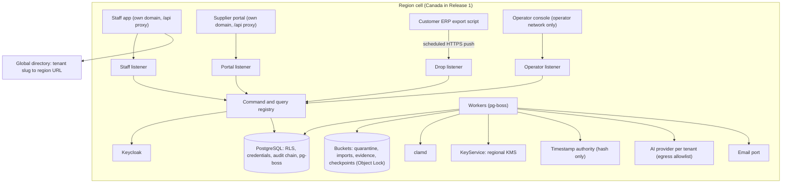
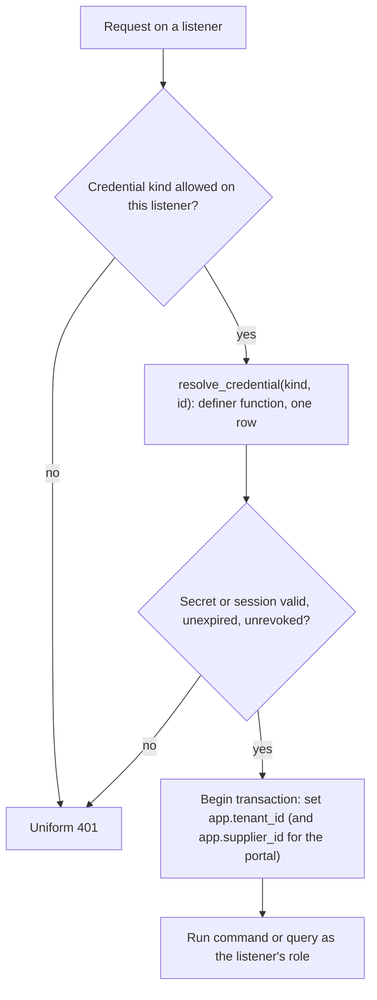
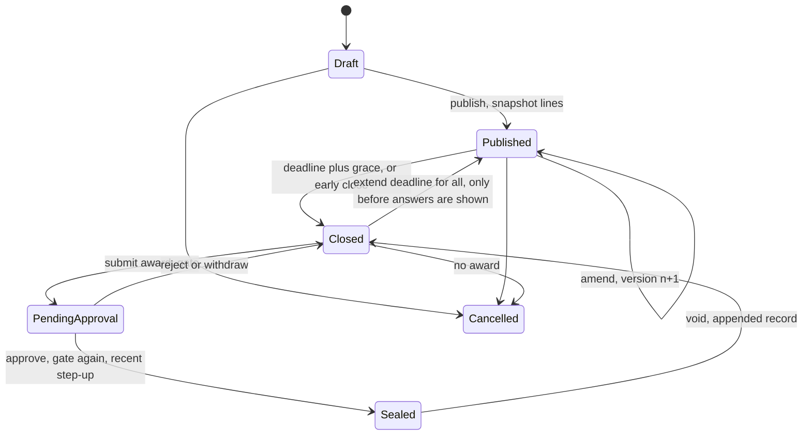
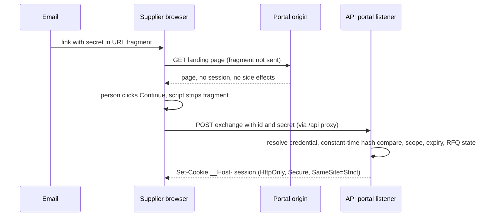
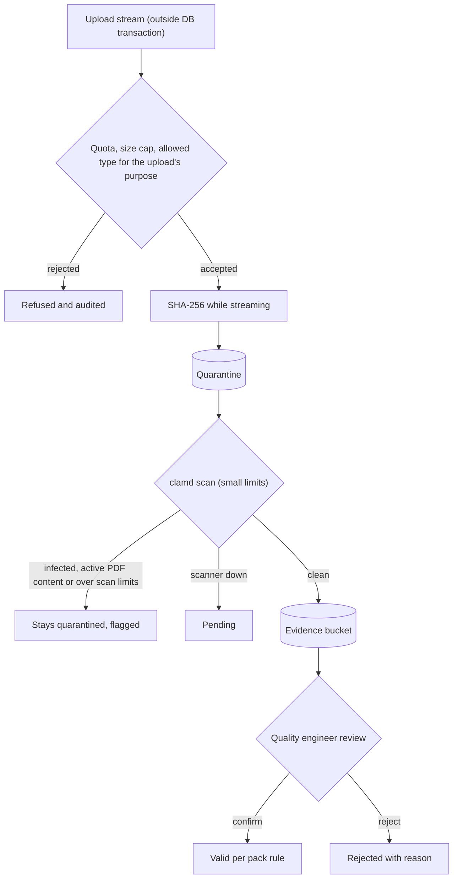
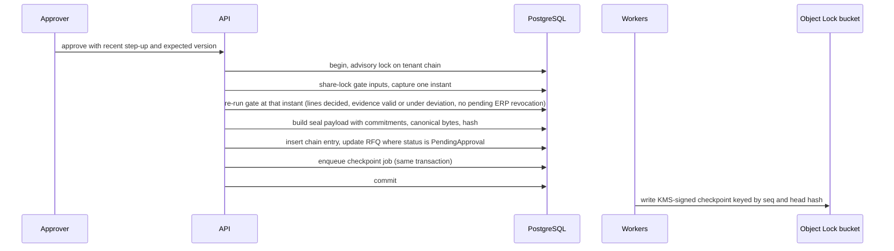
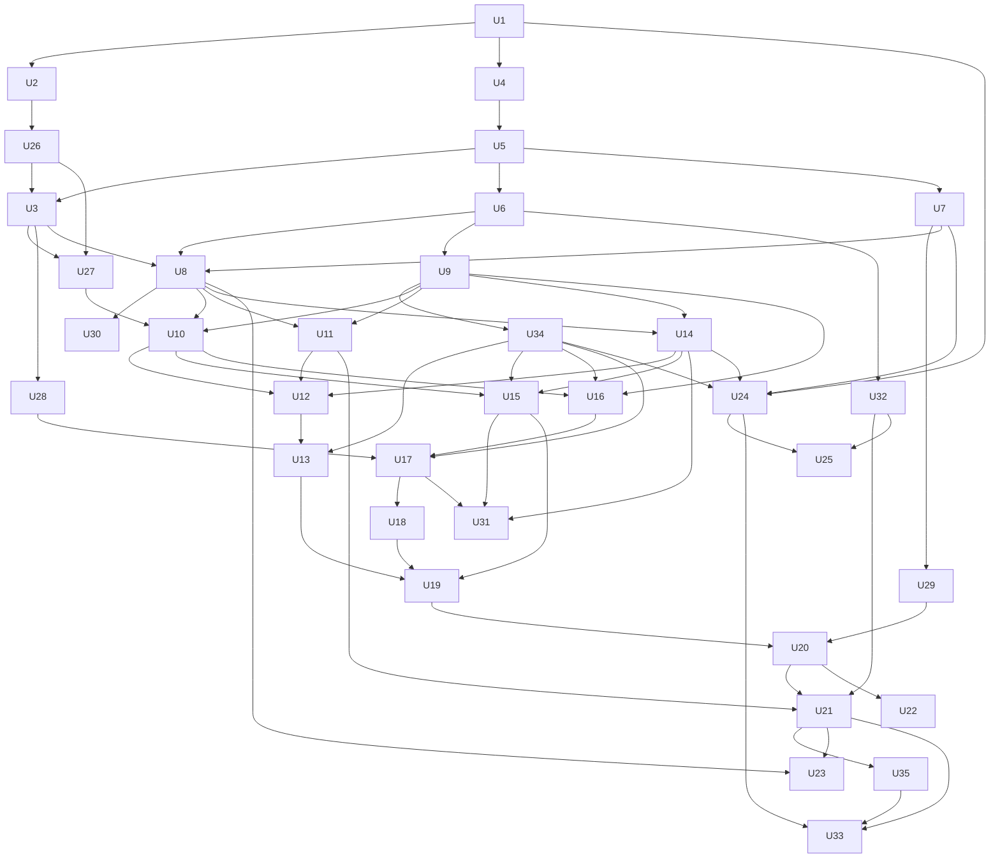

# Partledger Release 1 - Plan

**Target repo:** partledger (this repository). Product context: `docs/brief.md`. Working rules: `CLAUDE.md`.

---

## Goal Capsule

- **Objective:** build Release 1 of Partledger, a generic multi-tenant parts-and-suppliers platform that takes an RFQ from a parts list to a sealed, tamper-evident award (independently verifiable offline if the demand check in Dependencies confirms that feature), deployed in the Canada region and ready for its first customer once the IP gate clears.
- **Authority, highest first:** `CLAUDE.md`; this plan's Requirements and Key Technical Decisions; `docs/brief.md`; unit-level judgment.
- **Execution profile:** one implementation unit at a time per session, built by a cloud session running the repository's `build-unit` skill, or unattended with `build-all` (KTD6); code-factory tickets remain an option. Units whose dependencies are merged can run in parallel; parallel sessions follow the conventions in KTD38.
- **Tracking:** each unit is a GitHub issue titled `U<n>: <title>` on the repository's project board; the unit's pull request closes it.
- **Stop conditions:** a unit needs a decision that changes a Requirement or Key Technical Decision; gates stay red after five fix rounds; the work would put customer names, customer data or client-derived material into the repository; the work is specific to the first customer (their data, integration settings, branding) before the IP gate clears; a unit needs production credentials (U33 is operator-run); U21 or U32 would start before the demand check in Dependencies is recorded, or the check found no demand, in which case their scope returns to the product owner.
- **Tail ownership:** unit pull requests merge automatically under KTD6; the repository owner merges the ones KTD6 holds back, owns OVHcloud accounts and credentials, and runs production deploys. No unit deploys to production.

---

## Product Contract

### Summary

Release 1 delivers the platform core: import parts and suppliers, collect and verify supplier evidence, run RFQs that suppliers answer through scoped links, compare quotes, and approve awards into a sealed, tamper-evident record; offline verification by anyone follows if a demand check confirms that buyers and auditors want it. It ships the Canada market pack and a Canada-region deployment. The EU pack, AI reading of documents, customer evidence packs and an agent interface follow as later phases.

### Problem Frame

Small and mid-sized manufacturers source parts through spreadsheets and email. Their quality systems (AS9100, ISO 9001) and their own customers demand traceable supplier approval and sourcing decisions, and EU rules are adding supplier-evidence duties with fixed dates. Existing tools are enterprise procurement suites or compliance platforms without RFQs; none checked sells a sealed, auditor-verifiable award record or collects Cyber Resilience Act and Machinery Regulation evidence inside sourcing (`docs/brief.md`). The first customer is a Canadian aerospace manufacturer whose data must stay in Canada.

### Actors

- A1. Tenant admin: configures the tenant, users, roles, packs and integrations. The role alone grants no business action.
- A2. Buyer: builds and publishes RFQs, records quotes that suppliers sent outside the portal, selects winners, submits awards for approval.
- A3. Quality engineer: confirms or rejects supplier evidence, records evidence deviations, accepts alternates, maintains supplier approval when the platform owns it, and commits imports or held drops that change supplier approval.
- A4. Approver: approves, rejects or voids awards; never the submitter of the award.
- A5. Auditor: time-boxed, read-only, can export and verify.
- A6. Supplier contact: external; acts only through a scoped link.
- A7. System: scheduled and background work such as imports, deadline close, expiry, scans and checkpoints.
- A8. Platform operator: signs in through a separate operator realm and reaches a tenant only under an active break-glass grant that the tenant approved; every action is audited.
- A9. AI agent: produces suggestions only. In Release 1 it suggests import column mappings.

### Requirements

**Tenancy, residency and access**

- R1. Each tenant is pinned to one region at creation; its database rows, files, backups, logs and job processing stay in that region.
- R2. PostgreSQL row-level security isolates tenants; credentials presented before a tenant is known (staff sessions, supplier links, import-drop credentials, operator break-glass grants) resolve through one audited resolver, the only path outside a tenant context.
- R3. Roles are tenant-scoped records (tenant admin, buyer, quality engineer, approver, auditor) changed only by audited commands; they are additive, every command's permissions are enforced on the server, and no business command is allowed to the tenant-admin role alone.
- R4. Platform-operator access is break-glass: approved by the tenant, time-boxed and audited. Operators sign in through a separate realm, and their tenant context comes only from an active grant.

**Parts, suppliers and imports**

- R5. Parts, suppliers, contacts and the approved-supplier list (scope and expiry) can be imported from a spreadsheet; the AI suggests the column mapping and a person confirms it.
- R6. The same data can be imported from a scheduled Global Shop Solutions export drop; source-owned fields stay read-only, missing records are deactivated, and a missed drop raises an alert that reaches a person. Each tenant's export layout is a saved mapping, not code.
- R7. Imports commit all-or-nothing after a diff preview; ambiguous dates are rejected until the tenant confirms the date format.
- R8. An import never changes a published RFQ; open lines whose part changed show a drift flag.
- R9. A tenant chooses whether its approved-supplier list is owned by its ERP (read-only mirror) or maintained in the platform; an import or held drop that changes approved-supplier entries is committed only by a quality engineer.
- R10. Supplier identity is checked against the EU VAT register and the LEI register where applicable; the result is informational and never gates.

**Evidence**

- R11. A versioned requirement matrix per market pack decides which evidence each part category and supplier type needs; tenants may add requirements but never remove pack requirements.
- R12. Suppliers upload evidence through their link; every file is type-checked, hashed and malware-scanned before anyone can open it, and unscanned files are never served.
- R13. A quality engineer confirms or rejects each document; evidence is valid when confirmed, unexpired, in scope and the supplier's approval is active; undated attestations count for 12 months from issue.
- R14. Evidence expiring within 60 days is flagged to the tenant.
- R41. A quality engineer can record a time-limited deviation, with a reason, for a supplier's missing or invalid evidence of one type; the gate accepts an active deviation, the approval packet shows it, and the seal records it as a deviation.

**RFQs and supplier responses**

- R15. Buyers build RFQs from a parts list and assign one or more suppliers per line; publishing snapshots the lines.
- R16. Amending a published RFQ creates a new version, marks answers on changed lines stale until resubmitted, and notifies invited suppliers; deadline extensions apply to every supplier and record a reason. Once staff have seen the answers after close, the RFQ cannot be extended; a re-bid is a new RFQ round linked to the previous one, shown in the approval packet and recorded in the seal.
- R17. A supplier link gives one supplier organisation access to its own lines only. What it allows follows the RFQ's state: answering while open, reading its last submission after close, and its own outcome after the seal. It expires, can be revoked, and changes nothing when opened.
- R18. Per line, a supplier submits a quote (price per quantity break, currency, lead time, minimum order quantity, one-off costs, validity), a no-quote with reason, or an alternate; drafts save automatically and can be revised until the deadline.
- R19. The server decides lateness by its own receipt time against the UTC deadline and refuses late submissions.
- R20. Each submission records the submitter's declared name and an authority attestation; after an award is sealed, suppliers see only their own outcome.
- R40. Until an RFQ closes, staff see whether each supplier has responded but not the answers (Q10).
- R42. After close, a buyer can record a quote that a supplier sent outside the portal before the deadline, with the supplier's document attached through the upload pipeline; it is audited with the buyer as actor and marked buyer-recorded in the comparison and the seal.

**Comparison, approval and sealing**

- R21. The comparison view normalises each quote to a total cost in the tenant currency: the unit price at the applicable quantity break times the requested quantity (raised to the supplier's minimum order quantity), plus one-off costs, converted at a captured exchange rate. It highlights the lowest total cost and never preselects it.
- R22. Each line gets one winner or a no-award; a justification is required when the winner is not the lowest total cost; an alternate needs quality-engineer acceptance before it can win.
- R23. Submitting for approval and approving both re-check the gate: every line decided and every winning supplier's required evidence valid at that moment or covered by an active deviation (R41). When the approved-supplier list is ERP-owned, a pending drop that revokes or narrows a winner's approval blocks both, and the seal records the as-of time of the ERP mirror the gate used.
- R24. The approver cannot be the user who submitted the award, or anyone who recorded a selection, justification or manual exchange rate in the award version being approved; approval requires recent step-up authentication.
- R25. Approval seals the RFQ version, answers, selections, justifications, gate result, evidence hashes, submitter and approver into the tenant's hash chain; a wrong award is corrected by an appended void that returns the RFQ to selection.

**Audit and verification**

- R26. Every state change of record writes an insert-only audit entry recording actor type (person, AI agent, supplier token, system, platform operator), actor, the grant it acted under, and a correlation id; supplier draft autosaves are kept as versions outside the chain. A submission's audit entry carries its id, version and a hash of its answers, never the answer values.
- R27. Every chain is self-verified nightly. Subject to the demand check in Dependencies, signed checkpoints of each tenant's chain, each with an RFC 3161 timestamp from an independent timestamp authority, are written to write-once storage at every seal and daily.
- R28. Subject to the same check, an audit export bundles records, chain, checkpoints and their timestamps; a standalone verifier checks it offline against the published key list only, requires at least one checkpoint from outside the bundle, fails any seal not covered by a timestamped checkpoint issued within a day, and names the first failing record.
- R29. Auditors get time-boxed read-only access with export.

**AI**

- R30. The AI layer works with any supported provider; each tenant uses the platform default or its own key; region restriction is a per-tenant setting, off for the first customer and available to EU tenants.
- R31. AI output is stored as a suggestion that a person accepts; the AI's database role cannot change domain records, and untrusted document text is never given tools.

**Agent readiness**

- R32. Every domain action is a server command, and every read a server query, declared with typed input and output and allowed principals; reads include allowed transitions and blocking reasons as message keys.
- R33. State-changing commands accept an idempotency key and an expected version.

**Reports and user experience**

- R34. Reports cover cycle time (created to sealed), supplier responsiveness (answered of invited, time to first submission), quote variance against the line median, approval time (submitted to sealed) and expiring evidence; CSV exports neutralise formula injection.
- R35. The staff app and the supplier portal meet WCAG 2.2 AA in dark and light themes: keyboard-operable grids, visible focus, 4.5:1 text contrast, and designed loading, empty and error states.
- R36. All user-facing strings come from translation keys; Release 1 ships English.

**Operations and compliance**

- R37. Infrastructure is defined as code; production runs on OVHcloud in the Canada region with database backups restricted to Canada, nightly encrypted dumps to a second Canadian location, and a rehearsed restore.
- R38. A data processing agreement with EU standard contractual clauses (Module 2) and a transfer impact assessment, a sub-processor list, and a literal residency statement ("stored in Canada; staff in North Macedonia may access remotely; AI suggestions are processed by the configured provider in that provider's region") exist before the first customer goes live.
- R39. Personal data can be erased on request or at tenant offboarding without breaking chain verification, and erasure survives a restore from backup. Within the retention period for quality records, erasure removes contact details but keeps the identity of staff who submitted, justified or approved a sealed award, and the justification text. Import and drop files are deleted once their import commits or is discarded, and offboarding removes every stored object of the tenant.

### Key Flows

- F1. Import: spreadsheet upload or scheduled ERP drop, AI-suggested mapping confirmed by a person, validation, diff preview, all-or-nothing commit; drift flags on open RFQ lines.
- F2. Evidence: gap or expiry detected, evidence request link to the supplier, upload, scan, quality-engineer confirmation or rejection, expiry alerts, renewal.
- F3. RFQ: parts list to lines, suppliers per line, publish, amend or extend (never after staff have seen answers), deadline close; a re-bid after that is a new linked round.
- F4. Supplier response: link, own lines only, autosaved draft, answer every line, submit with declared identity, revise until close, read-only after close, own outcome after the seal.
- F5. Award: comparison after close, including buyer-recorded quotes; winner or no-award per line with justification; submit (gate, where an active deviation can cover missing evidence); independent recent step-up approval (gate again); seal; reject or void return the RFQ to selection.
- F6. Audit: in-app read-only view, or export bundle checked offline by the verifier against published keys.

### Acceptance Examples

- AE1. Covers R16. Given a published RFQ with submitted quotes on lines 1–3, when the buyer amends line 2, then version 2 is published, line-2 quotes are marked stale for every supplier, lines 1 and 3 keep their quotes, and invited suppliers are notified.
- AE2. Covers R23. Given a winning supplier whose certificate was valid when the award was submitted, when it lapses before approval, then approval is refused with a blocking reason naming that document, even if the expiry job has not run yet.
- AE3. Covers R24. Given a buyer who submitted an award and also holds the approver role, when they try to approve it, then the server refuses.
- AE4. Covers R19. Given a deadline of 12:00 UTC, when a submission reaches the server at 12:00:01 UTC, then it is refused and the draft stays available read-only.
- AE5. Covers R25. Given a sealed award, when an approver voids it with a reason, then a void record is appended, the original seal still verifies, and the RFQ returns to selection.
- AE6. Covers R8. Given a part on an open RFQ line, when an import changes that part's revision, then the RFQ line is unchanged and shows a drift flag.
- AE7. Covers R17. Given a supplier link fetched by an email scanner, then no session starts, no supplier action is recorded, and the link still works for the person.
- AE8. Covers R28. Given an exported bundle, when one byte of a sealed record is altered, then the verifier fails and names that record's sequence number; a bundle re-signed with a key that is not published also fails.
- AE9. Covers R39. Given a contact whose name appears in submissions and a seal, when the contact is erased, then no copy of the name remains in the database, job payloads or new exports, and every chain still verifies.
- AE10. Covers R27. Given a restore from a backup older than a tenant's last locked checkpoint, then that tenant's writes are blocked until a signed discontinuity entry is appended, and the verifier reports the discontinuity.
- AE11. Covers R17, R40. Given an RFQ that closed, when the supplier opens its link, then it can read its last submission but not change it; before close, staff see only that the supplier responded.
- AE12. Covers R39. Given a sealed award whose approver later requests erasure, when the erasure runs within the quality-record retention period, then the seal still names the approver and keeps the justification, the approver's contact details are gone, and every chain still verifies.

### Success Criteria

- A buyer runs an RFQ end to end on the Canada staging deployment: import, publish, supplier answers, comparison, independent approval, seal.
- If the demand check confirms it, an auditor verifies an exported award bundle offline with the published verifier and published key fingerprints.
- Before Phase D wires the key screens to the API, at least one practising buyer or quality engineer from outside the team, and not the first customer's staff while the IP gate is closed, has worked through the U3 key screens on synthetic data; findings are recorded without names in `docs/design/key-screens.md`.
- The tenancy suite shows no cross-tenant reads, the database catalog check passes, and every guard has a test that fails when the guard is removed.
- Every key screen passes automated accessibility checks in both themes and works by keyboard alone.

### Scope Boundaries

#### Deferred for later

- EU pack and EU-region deployment: Cyber Resilience Act evidence (SBOM, support period, vulnerability contact), Machinery Regulation declarations, REACH/SCIP, RoHS, conflict minerals (CMRT), CBAM data requests, NIS2 questionnaires, German and French UI.
- AI reading of supplier documents and quote PDFs, supplier suggestions, quote outlier flags.
- Customer evidence packs ("answer your customers").
- Agent interface: an MCP server over supplier-token verification, an A2A agent card, buyer-side agents, standing-policy reminders.
- US pack.

#### Outside this product's identity

- Drawings and export-controlled technical data.
- Supplier marketplace or discovery, payments, automatic negotiation, writing back to the ERP.

#### Deferred to Follow-Up Work

- Email one-time codes on supplier links; Managed Kubernetes; an on-premises ODBC connector for Global Shop Solutions; customer SSO connections beyond the first customer's; a tenant setting to show answers before close.

### Dependencies

- IP terms with the first customer agreed before Phase D (the RFQ-to-seal units) begins, and before the platform is used to deliver their contract. The product owner records, outside the repository, why the generic build falls outside that contract. If the terms are not agreed by then, the product owner re-plans before Phase D starts.
- A demand check before U21 or U32 starts: at least one target-segment buyer or quality lead and one AS9100 auditor walk through the U3 approval packet and a mocked export-and-verify result, and the answer is recorded without names in `docs/design/key-screens.md`. If they would not use offline verification, U21 and U32 return to the product owner; the hash-chained seal (R25) and nightly self-verification stay either way.
- The first customer's written acceptance that AI suggestions may be processed outside Canada by the configured provider, recorded before go-live.
- A sample Global Shop Solutions export from the first customer, used after the IP gate to configure that tenant's saved mapping; U13 ships the transport, safeguards and a synthetic example mapping, and no customer layout enters the repository.
- An OVHcloud account with a Canada project and KMS access, held by the operator; registrable domains for the staff app and, separately, the supplier portal.

### Outstanding Questions

All deferred and non-blocking; the plan adopts the stated default until the first customer confirms.

- Q1. How amendments treat submitted answers. Default: AE1.
- Q2. How a wrong sealed award is corrected. Default: AE5.
- Q3. Exact Canada pack contents per part category and supplier type. Default: AS9100 or ISO 9001 certificate for approved scope, plus the S-211 forced-labour attestation.
- Q4. Whether the award submitter may approve. Default: never (AE3).
- Q5. Whether a declared identity is enough on supplier submissions or an email code is required. Default: declared identity and authority attestation.
- Q6. Upload screening policy. Default: scanning plus a "no controlled technical data" attestation at upload.
- Q7. What "stays in Canada" covers. Default: R1 plus break-glass support access (R4) and the literal residency statement (R38), which names AI suggestions processed by the configured provider in its region.
- Q8. Whether Quebec users need a French UI. Default: English, with every string keyed.
- Q9. Global Shop Solutions export format, schedule and delivery. Default: a scheduled push of export files to an authenticated endpoint.
- Q10. Whether staff may read supplier answers before the deadline. Default: no; staff see response status only until close (R40), and an RFQ cannot be extended once staff have seen its answers (R16), which together prevent bid shopping.

### Sources

- `docs/brief.md` for product scope, market packs, competition and constraints.
- Research references (checked 2026-09-26) are listed in the Appendix next to the decisions they support.

---

## Planning Contract

### Key Technical Decisions

**Decided with the product owner**

- KTD1. The frontend is React with shadcn/ui. (session-settled: user-approved — chosen over Vue 3: matches the first customer's earlier proposal and eases any later handover)
- KTD2. Hosting is one identical deployment per region on OVHcloud, kept portable to Azure or AWS. (session-settled: user-directed — chosen over Azure-only and Hetzner: Canada need not be Azure; OVHcloud covers Canada and the EU with one provider and is not a US company)
- KTD3. The AI layer is provider-agnostic: the platform default or the tenant's own key, with region restriction as a per-tenant setting that is off for the first customer. (session-settled: user-directed — chosen over region-locked AI or AI switched off for Canada: the first customer may use any AI)
- KTD4. UX comes first: the design system and clickable key screens land before feature logic. (session-settled: user-approved — chosen over logic-first: the product sells on the clarity of dense screens)
- KTD5. The build stays generic; nothing specific to the first customer is built before the IP gate clears. (session-settled: user-approved — chosen over building to the first customer's specification now: avoids conflict with their separate contract)
- KTD6. Units are built with the repository's `build-unit` skill, or unattended with `build-all`, which works through ready units in Sequencing order; code-factory tickets remain an option. Each unit's pull request merges automatically once every gate passes: the in-session gates, reviews and verifier, then CI's `verify` on a branch that contains the latest `main`. The merge workflow (`.github/workflows/unit-merge.yml`, in place before U1) runs from `main`'s copy, so no pull request can change its own rule; only drafts (a finding the session could not resolve, or a change to `.claude/` or the plan) and changes to the merge workflow itself wait for the owner. (session-settled: user-directed — chosen over running the operator's factory inside cloud sessions: only cloud sessions spend the one-time cloud credit; automatic merging of every unit chosen over owner merges)

**Platform and structure**

- KTD7. The repository is a pnpm workspace with Nx and enforced module boundaries. `db`, `domain` and `packs` are API-only; `ui` is front-end-only; `contracts` is shared. A separate `libs/chain` (canonical JSON, hash chain, bundle schema) is the only library the verifier may import, so the open-source CLI never publishes business logic.
- KTD8. Runtime is Node 24 LTS, TypeScript 6 and NestJS 12 (ESM). NestJS 12 needs Node 22.22 or later, and TypeScript 7 lacks the compiler API that tooling still needs. The cloud-session environment installs Node 24 in its setup script.
- KTD35. Commands and queries are declared in `libs/contracts/src/<module>/`: name, input and output zod schemas with `.describe()`, and error reasons. Handlers, role policies and scope checks live in `apps/api`; routes are generated from the command and query registries. Web, portal and API ship together from one tag, and the supplier-facing API only gains fields within `/api/v1`, never loses or changes them. One declaration serves screens, tests and a later MCP tool list.
- KTD36. Every regional service sits behind a port with a local adapter: object storage (S3-compatible adapter; Azure Blob does not speak S3), keys (`KeyService` for envelope encryption and signing), email, malware scanning, exchange rates and RFC 3161 timestamps. Moving a region to another cloud means new adapters, not new callers.
- KTD38. Parallel sessions do not share single files: translation catalogues, permission expectations and job schedules are split per module; every pull request is rebased on `main` with migrations regenerated, and `drizzle-kit check` runs in `verify`.

**Data and transactions**

- KTD9. The database is PostgreSQL 18 on OVHcloud Managed Databases (Business plan, Beauharnois), accessed with Drizzle ORM 0.45 on node-postgres; migrations are drizzle-kit output plus hand-written SQL for forced row-level security, grants, triggers and policies. Drizzle v1 is still a release candidate.
- KTD10. Each request runs in one transaction held in CLS (`@nestjs-cls/transactional` with its Drizzle adapter) whose first statement is `select set_config('app.tenant_id', $1, true)`; policies compare against `nullif(current_setting('app.tenant_id', true), '')::uuid`. `SET LOCAL` cannot take bind parameters.
- KTD11. A migrator role owns the tables; the app role is not the owner, has no BYPASSRLS and no TRUNCATE; audit tables grant the app INSERT and SELECT only and carry triggers that raise on UPDATE, DELETE and TRUNCATE, because cascading foreign-key actions run as the owner; nothing cascades into audit tables. `tenant_id` is part of every unique constraint, and tenant-owned foreign keys are composite `(tenant_id, id)`, because unique and foreign-key checks bypass row-level security. A catalog check (forced RLS, policies, owners, grants, column privileges, foreign-key actions, triggers, definer functions, BYPASSRLS, `tenant_id` in every unique constraint or unique index on a tenant-owned table except server-generated uuid primary keys, and composite foreign keys between tenant-owned tables) runs in CI, after every migration, at boot and after a restore. Its one allowed policy exception is `pl_backup`, which reads every tenant row for the nightly dump (KTD32).
- KTD12. Time is `timestamptz` only, processes run with `TZ=UTC`, and raw SQL binds ISO strings cast to `timestamptz`. Hashed timestamps come from the application, never from `now()`. This avoids the known `Date` binding traps in raw SQL: pass-through in the postgres-js driver and local-time formatting in node-postgres.
- KTD13. Lifecycles are typed transition tables with a status column. One shared transition type and one `applyTransition` (a conditional `UPDATE … WHERE status = :from` plus its audit entry in the same transaction) are built once in U6; each aggregate keeps its table in `libs/domain`. XState is not used because restored snapshots break when the machine changes.
- KTD14. A handler returning a failure rolls back its transaction, so a command's effects happen entirely or not at all. Idempotency keys are inserted first, inside the transaction, unique per tenant, credential, command and key, with a body fingerprint; a reused key with a different body is refused, and the stored result is id-only with a time-to-live. Commands on versioned aggregates take an expected version.
- KTD15. The principal comes from the credential, never the request body: `person`, `ai_agent`, `supplier_token`, `system` or `platform_operator`, each carrying the grant it acted under, the entry adapter and a correlation id. A `platform_operator` credential is an active break-glass grant resolved through `resolve_credential`, so an operator's tenant context always comes from a grant the tenant approved. Portal requests run as a `pl_portal` role granted only the tables the portal needs, under a supplier-level policy (`app.supplier_id`) in addition to the tenant policy.
- KTD16. Background work runs on pg-boss as the `system` principal. Jobs are enqueued inside the command's transaction (pg-boss's `db` option), so follow-up work commits with its cause. Handlers are idempotent under concurrent redelivery, with per-item results unique on a domain key; job payloads carry ids, never personal data.
- KTD37. Credentials presented before a tenant is known (staff sessions, supplier links, drop credentials, operator break-glass grants, later MCP tokens) live in one credential table readable only through one `SECURITY DEFINER` function, `resolve_credential(kind, id)`, with a pinned `search_path`, returning one row by id. Every kind has the supplier-link shape: a public id plus a 256-bit secret, with only the secret's SHA-256 stored and compared in constant time after the id lookup. No other definer functions exist, and the catalog check enforces it.
- KTD39. Exchange rates are daily reference rates from the central bank of the tenant's base currency (Bank of Canada for CAD, the ECB for EUR), fetched by a job behind the exchange-rate port. A buyer may override a rate with an audited manual value, and the rate used is captured in the award.
- KTD40. Models stay open for later phases: evidence belongs to a supplier or to a supplier and part; each pack evidence type declares its metadata schema and validity rule, so rules such as "undated counts 12 months" are pack data; suggestions have a kind and a typed target (an entity field or an import mapping).

**Integrity and security**

- KTD17. The hash chain entry hash is SHA-256 over a domain tag followed by the RFC 8785 canonical bytes of `{tenant, seq, prevHash, actorType, actorId, actedUnder, time, schemaVersion, payload}`. The exact hashed bytes are stored and never recomputed from jsonb. Appends serialise per tenant with `pg_advisory_xact_lock`; `seq` is the head plus one, read after the lock, never a database sequence, so rollbacks leave no gaps; `time` is taken after the lock and clamped to be non-decreasing; the genesis entry chains to a fixed constant, so `UNIQUE(tenant_id, prev_hash)` covers it alongside `UNIQUE(tenant_id, seq)`. Personal and free-text values (names, justifications, reasons) enter payloads only as per-value salted commitments whose salt and value live in a commitment store outside the chain. `pl_portal` and `pl_ai_worker` get INSERT on the audit and commitment tables and column-level SELECT on the chain-head columns only (tenant, sequence number, entry hash, time) under a tenant-only policy, so they can append without reading other entries' payloads.
- KTD18. Chain heads are signed through `KeyService` with a regional KMS key (ECDSA P-256) and written to a compliance-mode Object Lock bucket at every seal and daily, under object keys that include the sequence number and head hash. Object Lock protects versions, not keys: the application's storage user may not delete in the checkpoint bucket, and the signer, reconciler and verifier list with ListObjectVersions, so a delete marker cannot hide a checkpoint. Each checkpoint also carries an RFC 3161 timestamp token from an independent timestamp authority, which sees only the hash. The signer refuses a head that contradicts the latest locked checkpoint. After a restore leaves a tenant's chain behind its last locked checkpoint, the tenant is read-only until a signed discontinuity entry, which the verifier accepts and reports, is appended. OVHcloud enables Object Lock only when a bucket is created, so buckets are created locked from day one.
- KTD19. A standalone, open-source verifier CLI checks export bundles offline. It trusts only the key list in `docs/security/key-fingerprints.md`, pinned into each release; a fingerprint printed on a seal receipt or passed on the command line is checked against that list and never trusted on its own. It requires at least one checkpoint obtained outside the export (a seal receipt the tenant kept, or a read-only listing of the checkpoint bucket); receipts packaged inside the bundle count as internal. It fails any seal not covered by a timestamped checkpoint issued within a day of the seal. It is shipped software, so it carries an SBOM, a vulnerability contact and a declared support period.
- KTD20. Staff sign in through Keycloak 26, self-hosted per region. Keycloak asserts identity and exactly one organization per session; roles are tenant rows in the platform changed by audited commands, and the API's Keycloak service accounts are split by purpose: an organizations account holds `manage-realm` and is used only to provision tenants and add or remove organization members, and an admin account holds `manage-users` and is used only for the second-factor reset. Keycloak 26.4 has no permission scoped to organizations or to a single user action, so each account can do more than its purpose; the owner accepted that residual scope (2026-09-27), and Keycloak admin events record every call either account makes. The API completes the OIDC code flow as a confidential client and keeps tokens server-side; the browser holds only a `__Host-` HttpOnly SameSite=Strict session cookie, and state-changing requests also require a custom header. Staff sessions have idle and absolute timeouts, refresh their tokens against Keycloak at a short interval and end when a refresh fails; roles are read from tenant rows on every request, and removing a membership ends the user's sessions. Approvals and the other high-impact commands (void, role grants and revocations, auditor grants, break-glass approvals, tenant AI-key changes, drop-credential issuance) require step-up: an `acr` at the configured level and an `auth_time` within a freshness window. Users who sign in through a customer's SSO enrol a Keycloak-held second factor for step-up. The realm disables automatic account linking by email and enables brute-force detection; its reset-credentials flow has no conditional OTP reset, so a lost second factor is reset only by an audited tenant-admin command that also ends the user's sessions. Keycloak runs with impersonation disabled, the API refuses tokens that carry an impersonator claim, and admin events are logged. Platform operators sign in through a separate operator realm with a required second factor. Customer SAML and OIDC are brokered inside Keycloak, so no SAML is parsed in Node. Auth0 (Canada and EU regions) is the fallback if operating Keycloak costs too much.
- KTD21. Supplier links carry a token `plk_<id>_<secret>` with a 256-bit secret, stored as SHA-256 and compared in constant time after lookup through the credential resolver. A link's scope is `rfq_response` or `evidence_request`; what it allows derives from the RFQ's state (answer while open, read after close, own outcome after the seal). Links expire and are revoked on cancel, supplier removal, removal of the contact they were sent to, a change of that contact's email, or explicit revoke; the supplier's open links are then reissued to its remaining contacts. The secret travels in the URL fragment; the portal exchanges it by POST after a user action for a `__Host-` session cookie with idle and absolute timeouts. Token verification is separate from cookie issuance, so a later MCP adapter can reuse it. GET requests have no side effects; failures return one uniform 401; exchanges are rate-limited per IP and uploads per link. The portal sends `Referrer-Policy: no-referrer` and `Cache-Control: no-store` and loads no third-party scripts.
- KTD22. Every file, including import spreadsheets, goes through one upload pipeline that streams outside the per-request database transaction, so slow uploads hold no pooled connection. Uploads have size caps, an allowlist per purpose (supplier evidence: PDF, PNG and JPEG, checked by magic bytes; staff imports and drops: XLSX without macros, and CSV validated as UTF-8 text with no NUL bytes), hashing while streaming, and a quarantine bucket. Parsing runs in a resource-capped worker with DTDs and external entities disabled and decompression limits. clamd scans in-region with small scan limits and `AlertExceedsMax yes`, and fails closed: content beyond the limits (`Heuristics.Limits.Exceeded`) is flagged and never served, and an unavailable scanner leaves files pending. PDFs with active content are flagged. Object keys are `t/{tenant}/evidence/{uuid}`, or `t/{tenant}/imports/{uuid}` in an unlocked imports bucket for import and drop files, with no filenames; an import file is deleted once its import commits or is discarded, and the audit entry keeps its hash. Downloads stream with `Content-Disposition: attachment`, `nosniff` and `CSP: sandbox`, and are audited.
- KTD24. Global Shop Solutions data arrives as scheduled export files pushed by the customer to an authenticated endpoint. Drop credentials expire, rotate and are IP-allowlisted; exports older than the last accepted one are refused. A drop auto-commits only when approved-supplier entries are unchanged, no contact's email changes, no contact is added to an existing supplier, and deactivations stay under a threshold. Anything else waits for review: quality engineers are notified, and a held diff that touches approved-supplier entries can be committed only by a quality engineer (R9). A direct ODBC connection would occupy one of the customer's Actian Zen licence seats and is deferred.
- KTD25. AI calls use the Vercel AI SDK v7. Providers come from a closed union with pattern-checked resource names and no free-form base URLs, constructed per call from tenant configuration and never from a bare model-id string, which would route through Vercel's gateway. Configuration falls back to the platform default all-or-nothing, never per field. Outbound AI calls pass an egress allowlist. Structured output uses `generateText` with `Output.object` and zod schemas written with `.nullable()` rather than `.optional()`, which OpenAI's strict mode rejects. Tenant keys are envelope-encrypted through `KeyService`.
- KTD26. Spreadsheets are parsed with a maintained parser (SheetJS from its CDN tarball, or ExcelJS), not the stale npm `xlsx` 0.18 release; CSV and XLSX exports prefix cells that start with `=`, `+`, `-`, `@`, tab or carriage return.
- KTD41. Operations follow least privilege: secrets live in a secret store, not in files on servers; OVHcloud, Keycloak admin and CI accounts are personal with MFA; Keycloak admin events and KMS audit logs go to the in-region log store; the database runs pgaudit; container images and CI actions are pinned by digest; dependency installs use a build-script allowlist and a minimum release age; alerts reach a person, not only a table.

**Frontend**

- KTD27. The front-ends use React 19, Vite 8, TanStack Router (typed routes, zod search params), TanStack Query, TanStack Table v9 (`useTable`, compatible with React Compiler), and React Hook Form with `useWatch` and zod. shadcn/ui runs on Base UI; focus styles use `outline-hidden` plus a ring so they survive forced colours.
- KTD28. The comparison grid follows the ARIA APG grid pattern (one tab stop; arrow, Home, End and Page keys), with a sticky header and pinned first column, and no row virtualisation below about 1,000 rows.
- KTD29. Design tokens are semantic CSS variables for dark and light themes, seeded from the operator's existing dark palette (near-black surfaces, cyan accent, Inter for text, JetBrains Mono for identifiers and numbers). CI computes every text and UI colour pair and fails below 4.5:1 for text or 3:1 for UI and focus. The existing palette's faint greys (`#636c74`, `#5c656d`) measure about 3.5:1 and 3.2:1 on its background, so they are not used for text.
- KTD30. The staff app and the supplier portal run on separate registrable domains and share the design-system library. Each front-end reaches the API through an `/api` proxy on its own origin, so there is no CORS, and the API runs one listener per entry adapter (staff, portal, drop, operator), each accepting only its own credential kinds; the operator listener is reachable only from the operator's network. A script injected into the portal cannot use a staff session.

**Operations and compliance**

- KTD31. Release 1 runs on plain OVHcloud instances in Beauharnois with Docker Compose behind Caddy, defined with OpenTofu and the `ovh/ovh` provider. Managed Kubernetes is deferred, since Canada offers only its Free plan.
- KTD32. Managed database backups are restricted to Canadian regions, because the default off-site copy for Beauharnois goes to Strasbourg, France. Nightly encrypted dumps go to a Toronto bucket: a dedicated `pl_backup` role, whose only policies are `SELECT USING (true)` on tenant tables, runs `pg_dump --enable-row-security --inserts`, and restores run through a matching restore role and end with the catalog check. A restore is rehearsed before go-live. Erasures are recorded in an id-only ledger outside the database and replayed after any restore, before the service reopens.
- KTD33. Email carries links only, never RFQ content, through the email port; the production provider processes in the tenant's region and is chosen in U24.
- KTD34. The hosted service is outside the Cyber Resilience Act, per the Commission's December 2025 FAQ. Shipped artefacts (the verifier CLI, any future on-premises connector) are in scope and get an SBOM, a vulnerability contact and a declared support period.

### High-Level Technical Design

Region cell. Each region runs the same cell; a global directory maps a tenant to its region and holds no customer data.



Credential resolution. Every request resolves its credential once, then runs entirely inside a tenant context.



RFQ lifecycle. Transitions outside this table are refused with Conflict. A re-bid after staff have seen the answers is a new RFQ linked to this one.



Supplier link exchange. The secret never reaches a server log because the fragment is never sent in a request line.



Evidence upload pipeline.



Approval and sealing. The checkpoint job is enqueued inside the sealing transaction, so a crash after commit still produces the checkpoint.



### Output Structure

```text
apps/
  api/          NestJS API: listeners, command and query handlers, jobs
  web/          staff app (React)
  portal/       supplier portal (React, own domain)
  verifier/     standalone audit verifier CLI (imports libs/chain only)
libs/
  contracts/    command and query declarations (zod), shared types, synthetic fixtures
  chain/        canonical JSON, hash chain, bundle schema, test vectors
  domain/       framework-free logic: transition tables, gate, validity rules, normalisation
  db/           Drizzle schema, migrations, roles, policies, triggers, catalog check
  ui/           design system: tokens, components, data grid
  packs/        market pack data (Canada first)
infra/
  tofu/         OpenTofu for OVHcloud
  compose/      Docker Compose, Caddy, clamd, Keycloak
docs/
  brief.md
  plans/
  design/
  integrations/
  runbooks/
  legal/
  security/
```

### Sequencing

After U1, Phase A lays foundations: the design lane (U2, U26, U3, U27, U28, with U3 also waiting for U5) and the data lane (U4 to U9, U29, U30, U34) run in parallel. Phase B adds master data, the AI suggestion path and uploads (U10, U11, U14). Phase C adds imports and evidence (U12, U13, U15). Phase D is the RFQ-to-seal spine (U16 to U21) with supplier evidence uploads (U31) and the verifier (U32). Phase E adds reporting, auditor access, infrastructure, legal documents, erasure and the operator-run staging drill (U22 to U25, U35, U33).

Product-owner gates outside the graph: Phase D starts only after the IP terms are agreed (Dependencies) and an outside buyer or quality engineer has tried the key screens (Success Criteria); U21 and U32 start only after the demand check (Dependencies).



### System-Wide Impact

- **Tenant isolation** is enforced in the database: every unit that adds a tenant-owned table adds its policy, grants, composite foreign keys and a cross-tenant test, and the catalog check fails the build on drift. Credentials resolve only through `resolve_credential`.
- **Transactions:** a failed command leaves nothing behind; idempotency records and follow-up jobs commit with the command that caused them; job handlers tolerate redelivery.
- **Audit and principals** touch every command; the permissions matrix and the one-entry-per-state-change test grow with each unit, split per module (KTD38).
- **Chain lifecycle:** restores are reconciled against locked checkpoints (AE10) and replay the erasure ledger before reopening; personal values in the chain are always commitments.
- **Residency** covers more than the database: backups, dumps, logs, email, malware scanning and AI calls each have a regional setting that U33 verifies.
- **Contracts:** web, portal and API ship together; the supplier-facing API only grows within `/api/v1`, so a later MCP adapter reuses the same declarations and token verification.
- **Agent parity:** because the UI calls the same commands and queries an agent will, later agent work adds listeners and adapters, not business logic.
- **Accessibility and translation** are gates on every UI unit, not a late pass.

### Risks & Dependencies

| Risk | Mitigation |
|---|---|
| IP conflict with the first customer's separate contract, whose scope overlaps Release 1 | KTD5; nothing customer-specific before the gate; IP terms agreed before Phase D, with the basis for the generic build recorded by the product owner, or a re-plan before Phase D (Dependencies) |
| OVHcloud Canada constraints: backups copied to France by default, Object Lock only at bucket creation, no browser POST uploads, only a Free Kubernetes plan | KTD18, KTD22, KTD31, KTD32; U24 encodes them and U33 verifies them on staging |
| A restore older than the last locked checkpoint forks a tenant's chain | KTD18 read-only hold and signed discontinuity entry; U33 rehearses it (AE10) |
| Grants, forced RLS or triggers drift through migrations, recreated tables or restores | KTD11 catalog check in CI, after migrations, at boot and after restore |
| Operator access to the database, KMS or Keycloak consoles leaves no trace; secrets sprawl | KTD41: personal MFA accounts, secret store, pgaudit, Keycloak admin events and KMS audit logs in-region, pinned images; Keycloak impersonation disabled (KTD20) |
| Build sessions install npm packages next to repository tokens | KTD41 build-script allowlist and minimum release age; pinned CI actions (U1) |
| A stolen drop credential or a truncated export rewrites approved suppliers or redirects supplier links | KTD24 expiry, rotation, IP allowlist, age check and auto-commit limits, including held contact-email changes |
| Tenant AI settings used to reach internal addresses | KTD25 closed provider union, no free-form URLs, egress allowlist |
| Decompression bombs, entity expansion or slow uploads exhaust the API | KTD22 capped parsing worker and uploads outside the transaction |
| Buyers leak competitors' prices before the deadline | R40 and Q10: answers hidden until close, including in audit entries, reports and exports; no extension once answers are seen (R16) |
| Breach notification duties (PIPEDA, Quebec Law 25, the Cyber Resilience Act's 24-hour warning for the verifier) | U25 breach runbook and incident register |
| Global Shop Solutions export format unknown until a sample arrives | U13 builds on synthetic fixtures; after the IP gate, the real sample configures that tenant's saved mapping, never repository code |
| Operating Keycloak (upgrades, backups) is a burden for two people | Quarterly upgrade runbook; Auth0 fallback (KTD20) |
| Tamper-evident awards may not be something buyers ask for | The demand check before U21 and U32 (Dependencies, brief risk 3); the hash-chained seal stays either way |
| Competitors (Tacto) add Cyber Resilience Act evidence | Phase 2 EU pack sequencing; speed on the verifiable award record |
| Drizzle v1 changes migrations when it leaves release candidate | Pin 0.45; schedule the upgrade as its own unit |
| Auto-merged pull requests break `main` when parallel units pass separately, or a pull request edits its own merge rule | The merge workflow runs from `main`'s copy (`workflow_run`), merges only branches that contain the latest `main`, at the commit CI tested, and never merges a change to itself (KTD6); units that change `.claude/` or the plan open drafts |
| The one-time cloud credit ends in early November 2026 | Units sized for one session each; the code factory continues on the plan or an API key afterwards |

---

## Implementation Units

| U-ID | Title | Key files | Depends on |
|---|---|---|---|
| U1 | Workspace, toolchain and gates | `package.json`, `nx.json`, `.github/workflows/ci.yml` | none |
| U2 | Design system: tokens, themes, components, states | `libs/ui/src/tokens/`, `libs/ui/src/components/` | U1 |
| U26 | Accessible data grid | `libs/ui/src/grid/` | U2 |
| U3 | Core key screens and typed client | `apps/web/src/`, `libs/contracts/src/client/` | U26, U5 |
| U27 | Secondary staff screens | `apps/web/src/routes/` | U3, U26 |
| U28 | Supplier portal screens | `apps/portal/src/routes/` | U3 |
| U4 | Database foundation: roles, RLS, credentials, catalog check | `libs/db/` | U1 |
| U5 | Command and query layer | `apps/api/src/commands/`, `libs/contracts/src/` | U4 |
| U6 | Audit trail, hash chain and transitions | `libs/chain/`, `apps/api/src/audit/` | U5 |
| U7 | Staff sign-in and sessions | `apps/api/src/auth/`, `infra/compose/keycloak/` | U5 |
| U29 | Step-up authentication | `apps/api/src/auth/step-up.guard.ts` | U7 |
| U8 | Tenants, roles, users and directory | `apps/api/src/tenants/` | U6, U7, U3 |
| U30 | Break-glass operator access | `apps/api/src/operator-access/` | U8 |
| U9 | Background jobs | `apps/api/src/jobs/` | U6 |
| U34 | Notifications, email port and alerts | `apps/api/src/notifications/` | U9 |
| U32 | Verifier CLI, bundle format and vectors | `apps/verifier/`, `libs/chain/` | U6 |
| U35 | Erasure and offboarding | `apps/api/src/erasure/` | U21 |
| U10 | Parts, suppliers and approved-supplier list | `apps/api/src/parts/`, `apps/api/src/suppliers/` | U8, U27, U9 |
| U11 | AI provider layer and suggestion store | `apps/api/src/ai/` | U8, U9 |
| U14 | Secure uploads and malware scanning | `apps/api/src/uploads/`, `apps/api/src/storage/` | U8, U9 |
| U12 | Spreadsheet import with AI column mapping | `apps/api/src/imports/` | U10, U11, U14 |
| U13 | Global Shop Solutions export-drop import | `apps/api/src/imports/profiles/gss.profile.ts` | U12, U34 |
| U15 | Evidence vault and the Canada pack | `libs/packs/src/canada/`, `apps/api/src/evidence/` | U14, U10, U34 |
| U16 | RFQ lifecycle and versioning | `libs/domain/src/rfq-lifecycle.ts`, `apps/api/src/rfqs/` | U10, U9, U34 |
| U17 | Supplier links and portal sessions | `apps/api/src/supplier-access/` | U16, U28, U34 |
| U18 | Supplier quote response | `apps/api/src/quotes/`, `apps/portal/src/routes/respond.tsx` | U17 |
| U31 | Supplier evidence requests and uploads | `apps/portal/src/routes/evidence.tsx` | U17, U15, U14 |
| U19 | Quote comparison, award selection and gate | `libs/domain/src/award-gate.ts`, `apps/api/src/awards/` | U18, U15, U13 |
| U20 | Approval and sealing | `libs/domain/src/seal-payload.ts`, `apps/api/src/awards/approval.commands.ts` | U19, U29 |
| U21 | Signed checkpoints and audit export | `apps/api/src/audit/checkpoint.job.ts` | U20, U32, U11 |
| U22 | Reports and safe exports | `apps/api/src/reports/` | U20 |
| U23 | Auditor access and audit viewer | `apps/api/src/auditors/`, `apps/web/src/routes/audit/` | U21, U8 |
| U24 | Canada infrastructure as code | `infra/tofu/canada/`, `infra/compose/` | U1, U7, U14, U34 |
| U25 | Privacy, legal and security documentation | `docs/legal/`, `docs/security/` | U24, U32 |
| U33 | Staging bring-up, restore drill and residency checklist | `docs/runbooks/` | U24, U21, U35 |

### U1. Workspace, toolchain and gates

**Goal:** a pnpm and Nx workspace with the apps and libraries from the Output Structure, strict TypeScript, lint, tests and CI, running the same way on a laptop and in a cloud session, with conventions that let parallel sessions merge cleanly.

**Requirements:** R36; enables every other requirement.

**Dependencies:** none.

**Files:** `package.json`, `pnpm-workspace.yaml`, `nx.json`, `tsconfig.base.json`, `eslint.config.mjs`, `vitest.workspace.ts`, `playwright.config.ts`, `.nvmrc`, `.npmrc`, `.github/workflows/ci.yml`, `apps/api/src/main.ts`, `apps/api/src/config/env.schema.ts`, `apps/api/src/health/health.controller.ts`, `apps/web/src/main.tsx`, `apps/portal/src/main.tsx`, `apps/verifier/src/main.ts`, `libs/contracts/src/index.ts`, `libs/chain/src/index.ts`, `libs/domain/src/index.ts`, `libs/db/src/index.ts`, `libs/ui/src/index.ts`, `libs/packs/src/index.ts`, `libs/contracts/src/i18n/`, `CLAUDE.md`, `.claude/skills/build-unit/SKILL.md`, `docs/runbooks/cloud-session-setup.md`, `apps/api/src/config/env.schema.spec.ts`, `apps/api/test/health.e2e-spec.ts`.

**Approach:**
- Pin Node 24 LTS (`.nvmrc`, `engines`), TypeScript 6 and ESM throughout; NestJS 12 for the API.
- Tag projects per KTD7 and enforce the boundaries in lint, including "the verifier imports only `libs/chain`".
- Parse the environment with zod at boot; the process refuses to start on invalid configuration, and nothing reads `process.env` outside the config module.
- Add scripts `lint`, `typecheck`, `test`, `test:integration`, `test:e2e`, `test:vectors`, `contrast:check`, `db:check` (drizzle-kit check) and `verify` (all gates); CI runs `verify` with actions pinned by digest.
- Supply chain (KTD41): a build-script allowlist and a minimum release age for dependencies in `.npmrc`/pnpm settings.
- Translation catalogues are per module under `libs/contracts/src/i18n/`, with a check that fails on literal UI strings (KTD38).
- Update `CLAUDE.md` to record React (KTD1) and the parallel-session conventions; document the cloud-session setup script (Node 24, pnpm) and its network allowlist in the runbook.
- The merge workflow (`.github/workflows/unit-merge.yml`, KTD6) is already on `main`: after the workflow named `CI` succeeds on a pull request, it squash-merges at the commit CI tested when the head branch is `unit/*`, the pull request is not a draft, the branch contains the latest `main`, and the diff leaves the merge workflow unchanged. U1 names its workflow `CI`, runs it on pull requests, and does not change the merge workflow. GitHub's built-in auto-merge and required checks need a paid plan on private repositories; this works on any plan.

**Execution note:** this is mostly scaffolding; prove it with a clean install and every gate green rather than broad unit coverage.

**Test scenarios:**
- An invalid `PORT` or unknown `NODE_ENV` makes the API refuse to boot with a message naming the field.
- `GET /api/v1/health` returns 200 with a body its zod schema parses; unprefixed `/health` returns 404.
- An import from `apps/api` inside `apps/web`, or from `libs/domain` inside `apps/verifier`, fails lint.
- A literal user-facing string in a component fails the translation check.
- Installing a dependency whose build script is not allowlisted fails.
- Installing a dependency version younger than the minimum release age fails.
- `pnpm verify` fails when a workflow references an action by tag instead of by digest.

**Verification:** a clean `pnpm install` followed by `pnpm verify` is green locally, in CI, and in a cloud session set up from the runbook; U1's own pull request is merged by the merge workflow.

### U2. Design system: tokens, themes, components and states

**Goal:** the shared UI library with semantic tokens for dark and light themes, typography, shadcn/ui components on Base UI and state components, with contrast enforced in CI.

**Requirements:** R35, R36.

**Dependencies:** U1.

**Files:** `libs/ui/src/tokens/tokens.css`, `libs/ui/src/tokens/themes.ts`, `libs/ui/src/components/`, `libs/ui/src/states/`, `libs/ui/scripts/contrast-check.ts`, `libs/ui/.storybook/`, `libs/ui/scripts/contrast-check.spec.ts`, `libs/ui/e2e/components.spec.ts`.

**Approach:**
- Seed the dark theme from the operator's palette: surfaces `#0e1113`, `#12171b`, `#171c20`, `#1b2025`; text `#e6eaed`; accent `#03fdfc`; success `#38d39f`; warning `#f5b945`; danger `#f2555a`; info `#6db0ef`. Replace the faint greys for any text use (KTD29).
- Design the light theme as its own palette, not an inversion.
- Components reference semantic tokens only (surface, text-primary, text-muted, accent, state colours); no raw hex values in components.
- Use Inter for text and JetBrains Mono for identifiers, prices and quantities.
- Provide loading, empty (with the next action), error (with retry and a message key) and no-permission state components.
- Storybook with the accessibility addon previews every component in both themes.

**Test scenarios:**
- The contrast check fails when a text pair drops below 4.5:1 (for example `#5c656d` on `#0e1113`) and passes on the shipped tokens in both themes.
- Forced-colours emulation keeps a visible focus indicator on buttons and inputs.
- Components render translation keys, not literals.
- Axe reports zero violations on every component preview in both themes.

**Verification:** `pnpm contrast:check` is green; component e2e and axe checks are green.

### U26. Accessible data grid

**Goal:** the grid primitive that the comparison, parts and supplier screens share, following the ARIA APG grid pattern.

**Requirements:** R35.

**Dependencies:** U2.

**Files:** `libs/ui/src/grid/data-grid.tsx`, `libs/ui/src/grid/use-grid-keyboard.ts`, `libs/ui/src/grid/data-grid.spec.tsx`, `libs/ui/e2e/grid.spec.ts`.

**Approach:**
- Build on TanStack Table v9 (`useTable`, declared features) per KTD27 and KTD28.
- One tab stop into the grid; arrow keys, Home, End, PageUp and PageDown move focus; `aria-sort` on sortable headers; sticky header and pinned first column.
- Cells can render state badges and editable controls without breaking grid navigation (Enter to edit, Escape to leave); every state badge carries an accessible name matching its legend entry (visually hidden text beside the icon or colour), so colour is never the only signal.
- No row virtualisation below about 1,000 rows; above that, `aria-rowcount` and `aria-rowindex`.

**Test scenarios:**
- Tab enters the grid once; arrow keys move one cell; Home and End jump within the row; PageDown moves a page.
- A sortable header exposes `aria-sort` and toggles on Enter.
- Focus stays visible in both themes and in forced colours.
- An editable cell enters edit mode on Enter and returns to grid navigation on Escape.
- A cell's state badge exposes its accessible name to assistive technology.

**Verification:** grid unit tests and keyboard-only e2e tests are green.

### U3. Core key screens and typed client

**Goal:** the app shell, a typed API client with fixture and HTTP adapters, and the three screens that make or break the product (RFQ detail, quote comparison, approval packet), reviewed before any logic is wired.

**Requirements:** R35, R36, R21, R22, R40.

**Dependencies:** U26, U5.

**Files:** `apps/web/src/shell/`, `apps/web/src/routes/rfqs/detail.tsx`, `apps/web/src/routes/rfqs/comparison.tsx`, `apps/web/src/routes/rfqs/approval.tsx`, `libs/contracts/src/client/api-client.ts`, `libs/contracts/src/client/fixture-adapter.ts`, `libs/contracts/src/client/http-adapter.ts`, `libs/contracts/src/rfqs/queries.ts`, `libs/contracts/src/fixtures/`, `docs/design/key-screens.md`, `apps/web/e2e/key-screens.spec.ts`.

**Approach:**
- Write the read contracts these screens show (KTD35) in `libs/contracts` with U5's `define` helper, so the HTTP adapter targets U5's generated routes; later units implement them on the API.
- One typed client with a fixture adapter (synthetic data) and an HTTP adapter; wiring a screen to the API swaps the adapter and keeps the components.
- Comparison shows lines as rows and suppliers as columns, with cell states (best price, submitted, alternate, no-quote, pending, stale, late), a legend, an evidence badge per supplier, and copy stating that the lowest price is highlighted but never chosen for you. Picking a winner that is not the lowest reveals a required justification. After close, each supplier column offers "record a quote received outside the portal", and such quotes carry a buyer-recorded marker.
- The RFQ detail shows response status per supplier while the RFQ is open, never answers (R40).
- The approval packet shows the gate checklist with blocking reasons, evidence status and any active deviation per winner, the previous round when the RFQ is a re-bid, and approve or reject actions that are disabled with their reason when blocked.
- Every screen designs loading, empty, error and no-permission states; `docs/design/key-screens.md` records flows and decisions.

**Execution note:** the product owner walks through these screens after this unit merges and before Phase D wires them to the API; UX fixes are cheapest here.

**Test scenarios:**
- Comparison highlights the lowest price cell and has no winner selected on load.
- Choosing a non-lowest winner shows a required justification; submitting without it shows the field error.
- An open RFQ's detail shows "responded" or "not yet" per supplier and no prices.
- An approval packet with a blocked gate lists its blocking reasons, and the approve action is disabled with its reason.
- Each of the seven comparison cell states exposes an accessible name matching its legend entry.
- Every screen passes axe in both themes and works by keyboard alone.

**Verification:** `docs/design/key-screens.md` records the flows and decisions; e2e and axe checks are green.

### U27. Secondary staff screens

**Goal:** fixture-driven dashboard, RFQ list, RFQ builder, parts list, supplier list, supplier assignment and evidence review screens on the U3 shell and client.

**Requirements:** R35, R36.

**Dependencies:** U3, U26.

**Files:** `apps/web/src/routes/dashboard.tsx`, `apps/web/src/routes/rfqs/list.tsx`, `apps/web/src/routes/rfqs/new.tsx`, `apps/web/src/routes/rfqs/assignment.tsx`, `apps/web/src/routes/parts/`, `apps/web/src/routes/suppliers/`, `apps/web/src/routes/evidence/`, `libs/contracts/src/parts/queries.ts`, `libs/contracts/src/suppliers/queries.ts`, `libs/contracts/src/evidence/queries.ts`, `apps/web/e2e/secondary-screens.spec.ts`.

**Approach:**
- Same client and fixture approach as U3; each screen declares its read contracts.
- Parts and supplier lists use the U26 grid with sort and filter; the supplier list shows approval scope, expiry and identity-check badges.
- The RFQ builder selects parts from the parts list and sets quantity breaks, required dates, the deadline and publishing; the RFQ detail gains amend and extend-deadline actions.
- Evidence review lists documents awaiting confirmation with their metadata, a view/download action through U14's audited download, confirm and reject actions, and reason entry; a quality engineer can also record a time-limited deviation with a reason (R41).
- Drift flags on RFQ lines and expiring-evidence badges have designed states.

**Test scenarios:**
- Each screen renders loading, empty, error and no-permission states.
- Supplier assignment shows which suppliers are outside a line's approved scope.
- Evidence rejection requires a reason before the action enables.
- The evidence review screen offers a view/download action for each document.
- The RFQ builder publishes an RFQ from fixture parts, and the RFQ detail's extend action is unavailable once answers have been shown.
- Every screen passes axe in both themes and works by keyboard alone.

**Verification:** e2e and axe checks are green.

### U28. Supplier portal screens

**Goal:** fixture-driven portal screens: link landing, response form, read-only submission view, evidence request list and outcome view.

**Requirements:** R35, R36, R17, R20.

**Dependencies:** U3.

**Files:** `apps/portal/src/shell/`, `apps/portal/src/routes/link.$linkId.tsx`, `apps/portal/src/routes/respond.tsx`, `apps/portal/src/routes/submission.tsx`, `apps/portal/src/routes/evidence.tsx`, `apps/portal/src/routes/outcome.tsx`, `libs/contracts/src/portal/queries.ts`, `apps/portal/e2e/portal-screens.spec.ts`.

**Approach:**
- The landing page explains what the supplier is about to open and offers one "Continue" action; it performs no request with side effects.
- The response form answers line by line, shows a draft-saved indicator, and shows the deadline in the supplier's time zone with UTC alongside.
- Copy states that suppliers see only their own lines and outcomes.
- The read-only submission and outcome views have no editable controls.
- Stale lines show a distinct "this line changed — review and resubmit" indicator, separate from the draft-saved indicator.
- Expired, revoked or wrong-secret links show a "link no longer available" state that tells the supplier to contact the buyer, with no retry action.

**Test scenarios:**
- A fixture supplier sees only its three assigned lines.
- The outcome view shows only its own lines' results.
- The landing page issues no mutating request until "Continue" is pressed.
- A fixture with a stale line shows the changed-line indicator on that line only.
- An expired or revoked link shows the "link no longer available" state with no retry action.
- The portal passes axe in both themes and works by keyboard alone.

**Verification:** e2e and axe checks are green.

### U4. Database foundation: roles, RLS, credentials and catalog check

**Goal:** the PostgreSQL foundation: owner, app, portal, AI-worker and verifier roles; forced row-level security; per-request tenant context; the credential table and resolver; the catalog check; and an integration harness that connects as the app role.

**Requirements:** R1, R2, R3.

**Dependencies:** U1.

**Files:** `libs/db/drizzle.config.ts`, `libs/db/src/schema/tenants.ts`, `libs/db/src/schema/credentials.ts`, `libs/db/src/schema/columns.ts`, `libs/db/migrations/0001_roles.sql`, `libs/db/migrations/0002_rls_helpers.sql`, `libs/db/migrations/0003_credential_resolver.sql`, `libs/db/src/catalog-check.ts`, `apps/api/src/db/db.module.ts`, `apps/api/src/db/tenant-transaction.ts`, `libs/db/test/harness.ts`, `libs/db/test/rls.integration.spec.ts`, `libs/db/test/catalog-check.integration.spec.ts`.

**Approach:**
- Roles: `pl_migrator` owns tables; `pl_app` gets DML without TRUNCATE and without BYPASSRLS; `pl_portal` is limited to portal tables (granted in U17); `pl_ai_worker` is limited to suggestion inserts (U11); both also append to the audit chain (grants in U6, KTD17); `pl_verifier` is read-only on audit tables; `pl_backup` reads every tenant row for the nightly dump (KTD32, job in U24).
- Every tenant-owned table has `tenant_id uuid not null`, `ENABLE` and `FORCE ROW LEVEL SECURITY`, and policies built on the KTD10 expression, with no branch for an empty context; unique constraints include `tenant_id`; tenant-owned foreign keys are composite `(tenant_id, id)` (KTD11).
- The credential table and `resolve_credential(kind, id)` follow KTD37.
- The catalog check (KTD11) is a function runnable from tests, from the migration script and at API boot.
- Timestamps follow KTD12.
- The harness runs PostgreSQL 18 in Testcontainers, applies migrations as `pl_migrator`, and runs tests as `pl_app`; the container's default superuser would bypass row-level security.

**Execution note:** write the cross-tenant denial test first and show it failing with the policy removed.

**Test scenarios:**
- With tenant A's context, selecting tenant B's rows returns none, and inserting a row with tenant B's id fails the policy check.
- With no tenant context set, tenant-owned tables return no rows.
- A row referencing another tenant's parent row fails its composite foreign key.
- `pl_app` cannot TRUNCATE or ALTER tenant tables, or SELECT the credential table directly; `resolve_credential` returns exactly one row by id and nothing for unknown ids.
- The catalog check fails when a tenant table lacks FORCE, a role has BYPASSRLS, an extra definer function exists, a unique constraint or unique index on a tenant table lacks `tenant_id`, or a foreign key between tenant tables is not composite; it passes on the shipped schema, with `pl_backup`'s read-all policies as its one allowed exception.
- The credential table stores only SHA-256 hashes of secrets, for every credential kind.
- A pooled connection reused after a committed transaction carries no tenant context.
- A timestamp bound through raw SQL round-trips as the same UTC instant.

**Verification:** the integration suite is green as `pl_app`; removing `FORCE ROW LEVEL SECURITY` from any table fails both a tenancy test and the catalog check.

### U5. Command and query layer

**Goal:** every domain action and read is declared once in `libs/contracts`, implemented in the API with allowed principals and typed results, reached through generated routes on per-adapter listeners, atomic and idempotent.

**Requirements:** R3, R26, R32, R33.

**Dependencies:** U4.

**Files:** `libs/contracts/src/define.ts`, `apps/api/src/commands/command-registry.ts`, `apps/api/src/commands/query-registry.ts`, `apps/api/src/commands/route-generator.ts`, `apps/api/src/listeners/`, `apps/api/src/principals/principal.ts`, `libs/domain/src/result.ts`, `libs/domain/src/domain-error.ts`, `apps/api/src/http/domain-error.filter.ts`, `apps/api/src/idempotency/idempotency.service.ts`, `libs/db/src/schema/idempotency-keys.ts`, `apps/api/src/commands/command-registry.spec.ts`, `apps/api/test/permissions/`, `apps/api/test/atomicity.integration.spec.ts`.

**Approach:**
- Declarations follow KTD35; handlers return `Result`; a failure rolls back the transaction (KTD14).
- `DomainError` is a discriminated union on `_tag` (NotFound, Conflict, Invalid, Unprocessable, Forbidden, Unavailable) with closed reason lists; one filter maps it to HTTP status and `{ message: 'pl.error.<key>', params }`; validation failures return `{ error, message, issues: [{ path, code }] }`.
- Listeners per KTD30 accept only their credential kinds; principals follow KTD15.
- Idempotency follows KTD14; expected versions return Conflict on mismatch.
- Reads of lifecycle aggregates return `allowedTransitions` and `blockingReasons`.
- Permission expectations live per module under `apps/api/test/permissions/` (KTD38); a rule test asserts no business command allows `tenant_admin` alone.
- Declarations carry a step-up flag; a rule test asserts that every high-impact command in KTD20's list is marked step-up once it exists.

**Test scenarios:**
- `describe.each(commands × principals)` pins the allow and deny matrix; removing one restriction fails the test.
- A command that writes and then returns a failure leaves nothing written.
- Two concurrent requests with the same idempotency key act once; a replay returns the first result.
- A key reused by a different credential never returns the first credential's result, and a reused key with a different body is refused.
- A stale `expectedVersion` returns 409 with a message key.
- A principal type in the request body is ignored, and a portal credential on the staff listener gets 401.
- The step-up rule test fails when a high-impact command is declared without the step-up flag.

**Verification:** matrix, atomicity and idempotency tests are green; adding an unmapped `DomainError` tag is a compile error.

### U6. Audit trail, hash chain and transitions

**Goal:** insert-only audit entries for every state change of record, chained per tenant with canonical hashing and commitments, verified nightly, plus the shared transition mechanism.

**Requirements:** R26, R27, R25, R39.

**Dependencies:** U5.

**Files:** `libs/chain/src/canonical-json.ts`, `libs/chain/src/hash-chain.ts`, `libs/chain/test-vectors/chain-v1.json`, `libs/db/src/schema/audit-entries.ts`, `libs/db/src/schema/commitments.ts`, `libs/db/migrations/0004_audit_grants_and_triggers.sql`, `apps/api/src/audit/audit-writer.ts`, `apps/api/src/audit/commitments.ts`, `apps/api/src/audit/chain-verifier.ts`, `libs/domain/src/transitions.ts`, `apps/api/src/transitions/apply-transition.ts`, `libs/chain/src/canonical-json.spec.ts`, `libs/chain/src/hash-chain.spec.ts`, `apps/api/test/audit-chain.integration.spec.ts`.

**Approach:**
- Canonicalise per RFC 8785 and hash as KTD17 describes, with the domain tag `partledger/chain/v1`; store the exact canonical bytes and the hash.
- Append inside the command's transaction under the tenant advisory lock, with `seq`, `time` and genesis handled per KTD17.
- Personal and free-text fields are typed as commitments: the writer refuses a payload that carries such a field raw; the commitment store holds salt and value outside the chain.
- Grants and triggers follow KTD11; a SELECT policy supports `RETURNING`; `pl_portal` and `pl_ai_worker` get INSERT on the audit and commitment tables and SELECT on the chain-head columns only, under a tenant-only policy (KTD17).
- The audit writer is the only insert path; every command calls it with the principal.
- `applyTransition` implements KTD13 for every aggregate.
- The nightly verification job (U9) checks every tenant's chain and alerts through U34 with the first failing sequence number.

**Execution note:** publish the canonicalisation and chain test vectors in this unit; U32's verifier consumes the same vectors.

**Test scenarios:**
- Canonical JSON matches RFC 8785 vectors for key order, numbers and escapes.
- Two concurrent appends for one tenant produce sequence numbers n and n+1, the second chained to the first; a rolled-back append leaves no gap.
- Appends for different tenants do not block each other.
- UPDATE, DELETE and TRUNCATE on audit tables fail for `pl_app` and for the owner (triggers).
- A payload with a raw name is refused; erasing a commitment's salt and value leaves the chain verifying.
- Verification detects a modified payload, a deleted middle entry and reordered entries, naming the first failing sequence number.
- `applyTransition` refuses a transition whose `from` state no longer matches.

**Verification:** vectors and integration tests are green; tampering with a row as superuser (with triggers disabled) makes verification fail at that row.

### U7. Staff sign-in and sessions

**Goal:** staff sign in through a per-region Keycloak; the API derives identity and one organization from server-held tokens and issues a session cookie with CSRF protection.

**Requirements:** R3, R1.

**Dependencies:** U5.

**Files:** `infra/compose/keycloak/realm.json`, `apps/api/src/auth/oidc.controller.ts`, `apps/api/src/auth/session.store.ts`, `apps/api/src/auth/jwks.ts`, `apps/api/src/auth/csrf.guard.ts`, `apps/web/src/auth/session.ts`, `docs/runbooks/keycloak.md`, `apps/api/test/auth.integration.spec.ts`, `apps/web/e2e/login.spec.ts`.

**Approach:**
- Keycloak 26 with Organizations; tokens must name exactly one organization, which maps to the tenant id (KTD20).
- The API runs the OIDC code flow with PKCE as a confidential client, stores tokens server-side, and issues the staff app a `__Host-` HttpOnly Secure SameSite=Strict session cookie; sessions resolve through `resolve_credential`.
- State-changing requests also require a custom header.
- Tokens are validated against cached JWKS (with rotation) for issuer, audience and expiry.
- `realm.json` disables automatic account linking by email and enables brute-force detection and admin events; Keycloak runs with `--features-disabled=impersonation`, and the API refuses tokens that carry an impersonator claim.
- Sessions have idle and absolute timeouts and refresh their tokens against Keycloak at a short interval; a failed refresh ends the session (KTD20).
- Local development uses a Keycloak container with synthetic users.

**Test scenarios:**
- Tokens from another issuer, expired tokens, and tokens naming zero or several organizations are refused.
- After signing-key rotation, new tokens validate once the JWKS cache refreshes.
- A state-changing request without the custom header is refused.
- A brokered login whose email matches an existing account is not linked automatically; repeated failed sign-ins trigger the brute-force lockout.
- The session cookie is `__Host-`, HttpOnly, Secure and SameSite=Strict.
- A token carrying an impersonator claim is refused.
- A user disabled in Keycloak is refused on the next request after the refresh interval.
- E2E: sign in and sign out against the API's session endpoints; after sign-out, the session is refused.

**Verification:** integration and e2e tests are green against the containerised Keycloak.

### U29. Step-up authentication

**Goal:** approval-grade actions demand a fresh step-up, including for users who sign in through a customer's SSO.

**Requirements:** R24.

**Dependencies:** U7.

**Files:** `apps/api/src/auth/step-up.guard.ts`, `apps/api/src/auth/factor-reset.command.ts`, `apps/web/src/auth/step-up.ts`, `infra/compose/keycloak/realm.json`, `apps/api/test/step-up.integration.spec.ts`.

**Approach:**
- Commands marked step-up require an `acr` at the configured level and an `auth_time` within the freshness window (KTD20); otherwise the API returns a typed step-up error.
- The staff app handles the error by re-authenticating with `acr_values` and retrying the command with the same idempotency key.
- Users brokered from a customer's SSO enrol a Keycloak-held second factor at first step-up.
- The realm's reset-credentials flow has no conditional OTP reset; a lost second factor is reset only by an audited tenant-admin command that also ends the user's sessions.

**Test scenarios:**
- A step-up command without the required `acr` returns the step-up error; with a fresh step-up it succeeds.
- A step-up older than the freshness window is refused.
- A brokered SSO user is asked to enrol a factor before the first step-up succeeds.
- Retrying after step-up with the same idempotency key performs the action once.
- The forgot-password flow cannot remove or replace a second factor.
- A second-factor reset writes an audit entry naming the admin and ends the user's sessions.

**Verification:** integration tests are green.

### U8. Tenants, roles, users and directory

**Goal:** operator-provisioned tenants pinned to a region, tenant-scoped roles managed by audited commands, user invitations, the global directory, and the web session wired into the U3 shell.

**Requirements:** R1, R3, R9, R11, R30.

**Dependencies:** U6, U7, U3.

**Files:** `libs/db/src/schema/tenants.ts`, `libs/db/src/schema/memberships.ts`, `libs/contracts/src/tenants/`, `apps/api/src/tenants/`, `apps/api/src/listeners/operator.listener.ts`, `infra/compose/keycloak/operator-realm.json`, `apps/api/src/directory/directory.controller.ts`, `apps/web/src/routes/admin/`, `apps/web/src/shell/session-provider.tsx`, `apps/api/test/tenants.integration.spec.ts`.

**Approach:**
- A tenant holds its name, region (immutable), enabled packs, approved-supplier-list source (`erp` or `platform`), AI policy (provider, key reference, region restriction) and base currency.
- Operators sign in through a separate Keycloak realm with a required second factor, on the operator listener (KTD30). Tenant provisioning is the only operator command allowed without a break-glass grant; it also creates the Keycloak organization.
- Memberships and roles are tenant rows changed by audited commands and read on every request; the API's Keycloak service account only adds or removes organization members, and removing a membership ends the user's sessions.
- The directory maps a tenant slug to its region URL and stores nothing else.
- The staff app's shell reads the session and roles through the U3 client's HTTP adapter.

**Test scenarios:**
- Changing a tenant's region is refused.
- A user who is an approver in tenant A cannot approve in tenant B.
- Granting or revoking a role writes an audit entry naming the admin who did it.
- An invited user exists only in the tenant's organization.
- A directory lookup returns only the region URL.
- A removed member, and a user whose approver role was revoked, are refused on their next request.
- Deleting a user referenced by audit entries fails.
- E2E: sign in, see the dashboard for the right tenant, sign out and lose access.

**Verification:** tenancy tests and the sign-in e2e test are green.

### U30. Break-glass operator access

**Goal:** time-boxed, tenant-approved operator access with every action audited.

**Requirements:** R4.

**Dependencies:** U8.

**Files:** `apps/api/src/operator-access/`, `apps/web/src/routes/admin/operator-access.tsx`, `apps/api/test/operator-access.integration.spec.ts`.

**Approach:**
- A tenant admin approves a grant with a start, an end and a reason; the approved grant is the operator's credential (`platform_operator` kind in `resolve_credential`), so the operator's tenant context comes from the grant, never the request.
- Every operator action is audited as `platform_operator` with the grant id.
- The tenant admin can end a grant early.

**Test scenarios:**
- An operator request for a tenant without an active grant gets the uniform 401.
- Operator credentials are refused on the staff, portal and drop listeners.
- With a grant, actions are audited with the grant id.
- After the grant's end or an early revoke, the operator is refused again.

**Verification:** integration tests are green.

### U9. Background jobs

**Goal:** a pg-boss job runner where scheduled and background work runs as the system principal, enqueued transactionally, with per-item results and redelivery-safe handlers.

**Requirements:** R26, R27; supports R6, R12, R14, R19.

**Dependencies:** U6.

**Files:** `apps/api/src/jobs/job-runner.module.ts`, `apps/api/src/jobs/job.types.ts`, `apps/api/src/jobs/system-principal.ts`, `apps/api/src/jobs/enqueue.ts`, `apps/api/test/jobs.integration.spec.ts`.

**Approach:**
- pg-boss runs on the region's database in its own schema; commands enqueue through the transaction (KTD16).
- Each job carries its tenant id and ids only; the runner opens a tenant transaction with a `system` principal acting under the schedule or the command that enqueued it.
- Jobs record per-item outcomes unique on a domain key; handlers tolerate redelivery while a previous run is still active.
- Schedules are registered per module (KTD38); this unit registers the nightly chain verification.

**Test scenarios:**
- Killing the process after a command commits still runs the job it enqueued; a rolled-back command enqueues nothing.
- A job failing on item 3 of 5 records items 1–2 done and item 3 failed; the retry processes items 3–5 only.
- A redelivered job running alongside the first does not apply an item twice.
- Job audit entries carry actor type `system` and the schedule reference.
- A job for tenant A cannot read tenant B's rows.

**Verification:** integration tests are green.

### U34. Notifications, email port and alerts

**Goal:** one outbox for notifications: link-only emails through an email port, in-app alerts, and operational alerts that reach a person.

**Requirements:** R6, R14, R16, R27.

**Dependencies:** U9.

**Files:** `apps/api/src/notifications/notification.service.ts`, `apps/api/src/notifications/email.port.ts`, `apps/api/src/notifications/local-email.adapter.ts`, `apps/api/src/notifications/templates/`, `libs/db/src/schema/notifications.ts`, `apps/web/src/shell/alerts.tsx`, `apps/api/test/notifications.integration.spec.ts`.

**Approach:**
- Commands record notifications in the same transaction; a job sends them through the email port with retries.
- Templates are built from message keys and carry links only, never RFQ content (KTD33).
- In-app alerts appear in the staff shell; operational alerts (failed chain check, missed drop, scanner down) go to configured people by email.
- The local adapter writes emails to a dev inbox; U24 adds the production provider adapter.

**Test scenarios:**
- A notification recorded by a rolled-back command is never sent.
- A rendered supplier email contains the link and no prices, part numbers or line descriptions.
- A failed send retries and eventually records a failure alert.
- An operational alert reaches the configured recipient.

**Verification:** integration tests are green with the local adapter.

### U32. Verifier CLI, bundle format and test vectors

**Goal:** the standalone verifier and the bundle-v1 format, built only on `libs/chain`, trusting only published keys.

**Requirements:** R28.

**Dependencies:** U6; starts only after the demand check in Dependencies confirms demand.

**Files:** `libs/chain/src/bundle-v1.ts`, `libs/chain/test-vectors/bundle-v1/`, `apps/verifier/src/main.ts`, `apps/verifier/src/verify-bundle.ts`, `apps/verifier/SECURITY.md`, `docs/verifier.md`, `docs/security/key-fingerprints.md`, `apps/verifier/src/verify-bundle.spec.ts`.

**Approach:**
- The bundle holds audit entries (canonical bytes and hashes), checkpoints with signatures, evidence hashes and a manifest, with evidence files optional.
- The verifier recomputes the chain, checks each checkpoint's signature against the key list pinned from `docs/security/key-fingerprints.md` (a fingerprint on a receipt or passed by the user is checked against that list, never trusted on its own), checks each checkpoint's RFC 3161 timestamp, requires at least one checkpoint supplied outside the bundle (receipts inside it count as internal), and fails any seal not covered by a timestamped checkpoint issued within a day (KTD19).
- It accepts signed discontinuity entries and reports them (KTD18).
- Exit codes distinguish pass, tamper detected, untrusted key, no external anchor and malformed bundle; `docs/verifier.md` and the vectors let an auditor write an independent verifier.
- Release tooling produces an SBOM; `SECURITY.md` names the vulnerability contact and support period (KTD34).

**Test scenarios:**
- A pristine vector bundle verifies; flipping one byte in a sealed record fails at that sequence number (covers AE8).
- A bundle re-signed with an unpublished key fails as untrusted, including when that key's fingerprint is printed on the seal receipt.
- Verifying with no external checkpoint, or with only receipts packaged inside the bundle, exits with the no-external-anchor result.
- A seal with no timestamped checkpoint issued within a day fails.
- A bundle whose chain is truncated before an externally supplied checkpoint fails.
- A bundle with a signed discontinuity verifies and reports the gap.
- The verifier cannot import anything outside `libs/chain` (lint).

**Verification:** verifier tests over the vectors are green.

### U35. Erasure and offboarding

**Goal:** erase personal data on request or at tenant offboarding without breaking chains, with erasures that survive restores.

**Requirements:** R39.

**Dependencies:** U21; everything U35 erases or tests against arrives through it.

**Files:** `apps/api/src/erasure/erasure.commands.ts`, `apps/api/src/erasure/erasure-ledger.ts`, `apps/api/src/erasure/offboarding.commands.ts`, `docs/runbooks/erasure.md`, `apps/api/test/erasure.integration.spec.ts`.

**Approach:**
- Erasing a person deletes their commitment salts and values, removes or redacts their rows outside the chain, and purges them from idempotency results and pending job payloads.
- Within the quality-record retention period (U25's retention schedule), erasing a staff member removes their contact details but keeps their identity on sealed awards they submitted, justified or approved, and the justification text (R39).
- Each erasure appends an id-only record to a ledger stored outside the database (KTD32).
- After any restore, the ledger is replayed before the service reopens (run in U33).
- Offboarding exports the tenant's data and a verifiable bundle, then erases the tenant and deletes every object under its storage prefix, removing evidence objects through a separate credential that holds governance-bypass rights.

**Test scenarios:**
- Erasing a contact leaves every chain verifying and no copy of the name in the database or new exports (covers AE9).
- Replaying the ledger against a database restored from before the erasure removes the data again.
- Offboarding produces an export that verifies, then leaves no tenant rows behind except what law requires to keep, and no objects under `t/{tenant}/`.
- An approver's erasure request leaves the sealed award naming the approver with the justification, and removes their contact details (covers AE12).

**Verification:** integration tests are green; the erasure runbook is written.

### U10. Parts, suppliers, contacts and approved-supplier list

**Goal:** the master data the rest of the product depends on, with commands, queries, identity checks, and the U27 screens wired to real data.

**Requirements:** R9, R10, R3, R35.

**Dependencies:** U8, U27, U9.

**Files:** `libs/db/src/schema/parts.ts`, `libs/db/src/schema/suppliers.ts`, `libs/db/src/schema/approved-suppliers.ts`, `libs/contracts/src/parts/commands.ts`, `libs/contracts/src/suppliers/commands.ts`, `apps/api/src/parts/`, `apps/api/src/suppliers/`, `apps/api/src/identity-checks/vies.client.ts`, `apps/api/src/identity-checks/gleif.client.ts`, `apps/api/test/suppliers.integration.spec.ts`, `apps/web/e2e/suppliers.spec.ts`.

**Approach:**
- Parts: number, revision, description, category, unit and source (`erp` or `platform`); source-owned fields are read-only.
- Suppliers: code, name, country, VAT id, LEI, status; contacts with name, email and role.
- Approved-supplier entries: supplier, scope (part categories or processes), status and expiry; editable only when the tenant's source is `platform`.
- VIES and GLEIF checks run as jobs and store their result and time; failures show "not checked" and never block.
- The U27 parts and supplier screens switch to the HTTP adapter.

**Test scenarios:**
- Editing a source-owned field of an ERP-sourced part is refused.
- With source `erp`, approved-supplier edits are refused; with `platform`, they succeed and are audited.
- A VIES timeout records "not checked" and the supplier stays usable.
- The parts and supplier screens show real data with loading, empty and error states.

**Verification:** integration and e2e tests are green.

### U11. AI provider layer and suggestion store

**Goal:** a provider-agnostic, SSRF-safe AI layer configured per tenant, the `KeyService` port, and a suggestion store through which all AI output reaches people.

**Requirements:** R30, R31, R26.

**Dependencies:** U8, U9.

**Files:** `apps/api/src/keys/key-service.port.ts`, `apps/api/src/keys/ovh-kms.adapter.ts`, `apps/api/src/keys/local-key.adapter.ts`, `apps/api/src/ai/provider-factory.ts`, `apps/api/src/ai/region-policy.ts`, `apps/api/src/ai/egress-allowlist.ts`, `apps/api/src/ai/structured-call.ts`, `apps/api/src/ai/suggestions.commands.ts`, `libs/db/src/schema/ai-suggestions.ts`, `libs/db/src/schema/tenant-ai-keys.ts`, `libs/db/migrations/0005_ai_worker_grants.sql`, `apps/api/src/ai/provider-factory.spec.ts`, `apps/api/test/ai-suggestions.integration.spec.ts`.

**Approach:**
- `KeyService` (encrypt, decrypt, sign) with a local adapter for development and an OVHcloud KMS adapter; U21 reuses it (KTD36).
- Providers follow KTD25: closed union, pattern-checked names, no base URLs, all-or-nothing fallback, egress allowlist, per-call construction.
- Tenant keys are envelope-encrypted and never logged or returned.
- The region policy refuses providers or regions outside a tenant's restriction with a typed error.
- Suggestions follow KTD40: a kind, a typed target, the base version, suggested value, source hash and location, confidence, model, provider, region and status; accepting one is a person's command that re-checks the base version.
- AI jobs connect as `pl_ai_worker`, which can only insert suggestions and append their audit entries (KTD17); input documents get no tools and are never applied automatically.

**Test scenarios:**
- A tenant restricted to the EU gets the region error for a non-EU provider; an unrestricted tenant succeeds.
- A configuration with a free-form base URL or a resource name outside the pattern is refused; a request to a metadata or private address is blocked by the egress allowlist.
- A partial tenant configuration uses the platform default entirely, never the platform key with tenant fields.
- A tenant key never appears in logs or API responses.
- `pl_ai_worker` cannot UPDATE a domain table.
- A stored suggestion has an `ai_agent` audit entry, and accepting or rejecting it writes a `person` entry.
- Accepting a suggestion whose base version changed returns Conflict; model output that fails its schema becomes a failed item with no partial write.
- The factory rejects a bare model-id string.

**Verification:** tests are green against a deterministic fake provider; one live smoke call per configured provider is documented.

### U14. Secure uploads and malware scanning

**Goal:** one upload pipeline for supplier documents, staff documents and import files: streamed outside the database transaction, capped, type-checked by content, hashed, quarantined, scanned in-region, parsed in a capped worker, and served safely.

**Requirements:** R12, R1.

**Dependencies:** U8, U9.

**Files:** `apps/api/src/uploads/upload.controller.ts`, `apps/api/src/uploads/magic-bytes.ts`, `apps/api/src/uploads/scan.job.ts`, `apps/api/src/uploads/parse-worker.ts`, `apps/api/src/uploads/download.controller.ts`, `apps/api/src/storage/storage.port.ts`, `apps/api/src/storage/s3.adapter.ts`, `infra/compose/clamd/`, `apps/api/src/uploads/magic-bytes.spec.ts`, `apps/api/test/uploads.integration.spec.ts`.

**Approach:**
- Implement KTD22: stream to quarantine while hashing, outside the per-request transaction; a short transaction records the upload afterwards.
- Enforce quotas per link and per tenant, size caps per type, and the allowlist for the upload's purpose (KTD22), with declared type and content required to agree.
- The scan job sends objects to clamd over the private network with small limits and `AlertExceedsMax yes`; `Heuristics.Limits.Exceeded` is flagged like an infection; an unavailable scanner leaves the file pending; PDFs with active content are flagged.
- Clean evidence moves to the evidence bucket and clean import files to the imports bucket; infected or flagged files stay quarantined.
- The parse worker (used by U12) runs with memory and time limits, DTDs and external entities off, and decompression caps.
- Downloads stream with safe headers and write an audit entry.
- Uploaders attest that the file holds no controlled technical data (Q6).

**Test scenarios:**
- The EICAR test file ends up quarantined and flagged, and can never be downloaded.
- A binary renamed to `.pdf` is rejected; a PDF with embedded JavaScript is flagged.
- With clamd stopped, a file stays pending and cannot be downloaded; after restart, the job completes.
- A file over its cap is refused mid-stream and leaves no object behind; a link over its quota is refused.
- A slow upload does not hold a database connection for its duration.
- An XLSX decompression bomb is stopped by the parse worker's limits; an XLSX whose XML declares a DTD or carries an entity-expansion payload is refused; a macro-enabled workbook renamed to `.xlsx` is rejected.
- An archive whose content exceeds the scan limits ends up flagged, not clean.
- A CSV or XLSX sent through an `evidence_request` link is refused; a CSV import containing binary content is refused.
- A download carries attachment, nosniff and sandbox headers and writes an audit entry; the stored hash equals an independent SHA-256.

**Verification:** integration tests are green against a clamd container and a local S3-compatible store.

### U12. Spreadsheet import with AI column mapping

**Goal:** import parts, suppliers, contacts and approved-supplier entries from XLSX or CSV with AI-suggested column mapping, validation, a diff preview and an all-or-nothing commit.

**Requirements:** R5, R7, R8, R31.

**Dependencies:** U10, U11, U14.

**Files:** `apps/api/src/imports/import-pipeline.ts`, `apps/api/src/imports/column-mapping.ts`, `apps/api/src/imports/diff.ts`, `libs/domain/src/dates.ts`, `libs/contracts/src/imports/`, `apps/web/src/routes/imports/`, `libs/domain/src/dates.spec.ts`, `apps/api/test/imports.integration.spec.ts`, `apps/web/e2e/import.spec.ts`.

**Approach:**
- Files arrive through U14 and are parsed by its worker with the KTD26 parser; macro-enabled files are rejected.
- The AI proposes column mappings as suggestions of kind "import mapping"; a person confirms or edits them; confirmed mappings are saved per tenant and source.
- Validate every row with message keys; reject dates where day and month are both 12 or less until the tenant confirms a format.
- The diff preview shows created, changed (field by field), deactivated (missing from the source) and unchanged records.
- Commit in one transaction with one audit entry carrying counts and the file hash; a diff that touches approved-supplier entries can be committed only by a quality engineer (R9).
- The import file is deleted from the imports bucket when its import commits or is discarded (KTD22).
- Imports write master data only; drift on open RFQ lines is computed by U16 from the line snapshot.

**Test scenarios:**
- A file with three invalid rows cannot be committed, and nothing is written.
- `04/05/2027` is rejected until the format is confirmed, then parses as intended.
- A part missing from the new file is deactivated, not deleted.
- Committing an import never writes RFQ tables.
- Nothing is imported until a person confirms the mapping.
- A buyer cannot commit an import that changes approved-supplier entries; a quality engineer can.
- No import file remains in storage after its import commits or is discarded.

**Verification:** integration and e2e tests are green.

### U13. Global Shop Solutions export-drop import

**Goal:** ingest scheduled Global Shop Solutions exports pushed to an authenticated endpoint, with safeguards against stolen credentials and bad exports.

**Requirements:** R6, R7, R8.

**Dependencies:** U12, U34.

**Files:** `apps/api/src/listeners/drop.listener.ts`, `apps/api/src/imports/drop-credentials.ts`, `apps/api/src/imports/profiles/gss.profile.ts`, `libs/contracts/src/fixtures/gss/`, `docs/integrations/global-shop-solutions.md`, `apps/api/test/gss-drop.integration.spec.ts`.

**Approach:**
- Drop credentials follow KTD24 and resolve through `resolve_credential`; a customer-side scheduled script pushes export files over HTTPS; nothing connects into the customer's network.
- The profile covers transport, credentials, the schedule expectation and safeguards, with a synthetic example mapping of supplier master, approved-vendor list with capabilities, part master and BOM references. After the IP gate, a real customer's layout is configured as that tenant's saved mapping through U12, never as a change to `gss.profile.ts` (Q9).
- A drop auto-commits as `system` only under the KTD24 conditions; otherwise it waits for review and notifies quality engineers through U34.
- A per-tenant schedule expectation raises one alert when no drop arrives within its window plus grace.
- `docs/integrations/global-shop-solutions.md` documents the customer-side export and push script.

**Test scenarios:**
- A drop with an expired, revoked, wrong-tenant or non-allowlisted credential gets the uniform 401.
- A clean drop with unchanged approved-supplier entries commits automatically and is audited as `system` under the drop credential.
- A drop that changes approved-supplier entries, changes a contact's email, adds a contact to an existing supplier, or deactivates more records than the threshold, waits for review.
- A buyer cannot commit a held drop that changes approved-supplier entries; a quality engineer can.
- An export older than the last accepted one is refused.
- A missed window raises exactly one alert.

**Verification:** integration tests are green on synthetic fixtures; the push script is documented.

### U15. Evidence vault and the Canada pack

**Goal:** evidence records with quality-engineer review, pack-defined validity rules and expiry alerts, driven by a versioned Canada pack.

**Requirements:** R11, R12, R13, R14, R9, R41.

**Dependencies:** U14, U10, U34.

**Files:** `libs/packs/src/canada/v1.ts`, `libs/packs/src/evidence-type.ts`, `libs/domain/src/evidence-validity.ts`, `libs/db/src/schema/evidence.ts`, `libs/db/src/schema/evidence-deviations.ts`, `apps/api/src/evidence/`, `apps/api/src/evidence/expiry.job.ts`, `libs/domain/src/evidence-validity.spec.ts`, `apps/api/test/evidence.integration.spec.ts`, `apps/web/e2e/evidence-review.spec.ts`.

**Approach:**
- Each evidence type declares its metadata schema and validity rule as pack data (KTD40); the matrix maps evidence type, part category and supplier type to "required", with a version; tenants add requirements; removing a pack requirement is refused.
- Canada pack v1 seeds the Q3 default.
- Evidence belongs to a supplier or to a supplier and part; it holds type, scope, issue date, expiry, file, status (submitted, confirmed, rejected, expired, superseded) and reviewer.
- Validity is a pure function evaluated at a given instant from dates, confirmation, scope and supplier approval, returning reason keys; it never trusts the expiry job's status.
- A quality engineer confirms, or rejects with a reason; the supplier is notified through U34.
- A quality engineer records a time-limited deviation, with a reason, for a supplier's missing or invalid evidence of one type (R41); validity reports "covered by deviation" while it is active, and the deviation is audited.
- The expiry job flags evidence expiring within 60 days and marks expired evidence for display.
- The U27 evidence review screen switches to the HTTP adapter.

**Test scenarios:**
- Validity is valid only when all conditions hold, and each failing condition returns its own reason key (table-driven).
- An undated attestation issued 2026-01-10 is valid through 2027-01-10 and invalid on 2027-01-11 under the Canada pack rule.
- Adding a tenant requirement extends the gap list; removing a pack requirement is refused.
- The expiry job flags a certificate expiring in 59 days and not one expiring in 61.
- Rejecting a document requires a reason and notifies the supplier.
- An active deviation makes that evidence type count as covered; after its end date it no longer does.
- Opening a document from the evidence review writes a download audit entry.

**Verification:** table-driven domain tests, integration tests and the evidence review e2e test are green.

### U16. RFQ lifecycle and versioning

**Goal:** RFQs built from a parts list with suppliers assigned per line, governed by the transition table, with versioned amendments, drift flags, deadline handling and cancellation.

**Requirements:** R15, R16, R19, R8, R32.

**Dependencies:** U10, U9, U34.

**Files:** `libs/domain/src/rfq-lifecycle.ts`, `libs/db/src/schema/rfqs.ts`, `libs/db/src/schema/rfq-lines.ts`, `libs/db/src/schema/rfq-versions.ts`, `libs/contracts/src/rfqs/commands.ts`, `apps/api/src/rfqs/`, `apps/api/src/rfqs/deadline-close.job.ts`, `libs/domain/src/rfq-lifecycle.spec.ts`, `apps/api/test/rfqs.integration.spec.ts`, `apps/web/e2e/rfq-create.spec.ts`.

**Approach:**
- The transition table covers the states in the lifecycle diagram, applied through `applyTransition` (KTD13).
- Publishing snapshots each line (part number, revision, quantity breaks, required date) into version 1.
- Suppliers are assigned per line and checked against the approved-supplier scope; a tenant setting chooses warn or block.
- Amending creates version n+1 and records which lines changed; answers carry the line version they answered, so staleness derives from versions; invitees are notified through U34.
- Drift is computed by comparing each open line's snapshot with the current part.
- Deadlines are stored in UTC; the close job runs after the deadline plus the request timeout, so on-time submissions in flight still land; extensions apply to all suppliers and record a reason.
- The RFQ records when answers are first shown to staff after close (set by U18's staff query); extension is refused from then on, and a re-bid is a new RFQ linked to the previous one (R16).
- Amendments, extensions and the close job take a transaction-scoped advisory lock keyed on the RFQ id; U18's submissions take its shared form.
- Reads return allowed transitions and blocking reasons; the U3 and U27 RFQ screens, including the U27 RFQ builder and its amend and extend-deadline actions, switch to the HTTP adapter.

**Test scenarios:**
- Every state pair outside the table is refused with Conflict (table-driven over all pairs).
- Amending line 2 creates version 2 with line 2 marked changed and notifies invitees.
- A part revision changed by an import shows a drift flag on its open line and leaves the snapshot unchanged (covers AE6).
- Assigning a supplier outside its approved scope is blocked or warned per the setting.
- The close job closes an RFQ after deadline plus grace and audits as `system`.
- Extending a closed RFQ reopens it for every supplier and records the reason.
- After an early close and a buyer reading the answers, an extension is refused; a re-bid creates a new RFQ linked to the previous one.
- Two buyers publishing the same draft concurrently: one succeeds, one gets Conflict.

**Verification:** domain and integration tests are green; the RFQ creation e2e test is green.

### U17. Supplier links and portal sessions

**Goal:** scoped supplier links whose secret never reaches a server log, whose allowed actions follow the RFQ's state, exchanged on the portal for a short-lived session running under the portal role.

**Requirements:** R17, R2, R26, R40.

**Dependencies:** U16, U28, U34.

**Files:** `libs/db/src/schema/supplier-links.ts`, `libs/db/migrations/0006_portal_role.sql`, `apps/api/src/supplier-access/link-issuer.ts`, `apps/api/src/supplier-access/token-verifier.ts`, `apps/api/src/supplier-access/link-exchange.controller.ts`, `apps/api/src/listeners/portal.listener.ts`, `apps/api/src/supplier-access/rate-limit.ts`, `apps/api/test/supplier-links.integration.spec.ts`, `apps/portal/e2e/link-exchange.spec.ts`.

**Approach:**
- Implement KTD21: link scopes `rfq_response` and `evidence_request`; allowed actions derived from RFQ state; revocation on cancel, supplier removal, removal of the contact the link was sent to, a change of that contact's email, or explicit revoke, with the supplier's open links reissued to its remaining contacts.
- Emails carry `https://<portal>/link/<id>#<secret>` through U34 and nothing about the RFQ's content.
- Token verification is its own service; the exchange controller calls it and then issues the cookie.
- Portal requests run as `pl_portal` with `app.supplier_id` set (KTD15); grants cover portal tables only.
- The portal sets strict CSP, no-referrer and no-store on every response; the portal screens from U28 switch to the HTTP adapter.

**Test scenarios:**
- A GET of the link URL starts no session and records no supplier action (covers AE7).
- A wrong secret, an expired link and a revoked link return the same 401 body.
- A session for supplier A cannot read supplier B's rows on the same RFQ, even through a query that forgets its own filter (portal role policy).
- After close, the link reads the last submission but cannot change it; after the seal, it shows only the outcome (covers AE11).
- Revoking a link mid-session makes the next request fail.
- Cancelling the RFQ, removing the supplier, removing the contact and changing the contact's email each make the old link return the uniform 401.
- Every portal response carries the CSP, `Referrer-Policy: no-referrer` and `Cache-Control: no-store`; a portal session past its idle timeout or absolute lifetime gets the uniform 401.
- A portal action appends to the chain after another supplier's entry, and the portal role cannot select that entry's payload.
- Server and access logs never contain a secret; the exchange endpoint rate-limits repeated attempts from one IP.

**Verification:** integration and portal e2e tests are green.

### U18. Supplier quote response

**Goal:** suppliers answer every assigned line with a quote, a no-quote or an alternate, save drafts, submit with a declared identity, and revise until the deadline.

**Requirements:** R18, R19, R20, R16, R40, R42, R35.

**Dependencies:** U17.

**Files:** `libs/contracts/src/quotes/`, `libs/db/src/schema/quotes.ts`, `apps/api/src/quotes/`, `apps/portal/src/routes/respond.tsx`, `apps/portal/src/routes/submission.tsx`, `apps/api/test/quotes.integration.spec.ts`, `apps/portal/e2e/respond.spec.ts`.

**Approach:**
- Per line: a quote (quantity breaks with unit price, currency, lead time in days, minimum order quantity, one-off costs, validity date), a no-quote with a reason code, or an alternate (specification text plus price fields).
- Drafts autosave through an idempotent command with an expected version; drafts are versions outside the chain (R26).
- Submitting needs an answer on every line at the current line version, the declared submitter name (stored as a commitment in the chain) and an authority attestation; the server's receipt time is the submission time; submissions take the shared form of the RFQ's advisory lock (U16), so a concurrent amendment or close orders cleanly without granting `pl_portal` UPDATE on RFQs.
- Each revision before the deadline is a new submission version; after close, the portal shows the last submission read-only.
- Staff queries expose response status only until close (R40); a submission's audit entry carries its id, version and a hash of its answers, never the values (R26). The first staff read of answers after close records that moment on the RFQ (U16).
- After close, a buyer records a quote that a supplier sent outside the portal before the deadline, on the supplier's behalf, with the supplier's document attached through U14; it is a submission marked buyer-recorded and audited with the buyer as actor (R42).

**Test scenarios:**
- Submitting with an unanswered line fails with those line numbers in the error params.
- A submission received after the deadline is refused and the draft stays readable (covers AE4).
- With submitted quotes on lines 1–3, amending line 2 leaves line-2 answers stale and lines 1 and 3 current (covers AE1).
- A submission racing an amendment ends stale or refused, never current on the old version.
- Staff queries before close return response status and no answers; after close, answers.
- A submission's audit entry contains no price, quantity break or alternate text.
- After an amendment, the supplier's response form marks only the changed lines for resubmission.
- A buyer-recorded quote after close appears in comparison marked buyer-recorded; recording one before close is refused.
- A revision creates version 2, and comparison uses the latest submitted version.
- The response flow passes axe and works by keyboard alone.

**Verification:** integration and e2e tests are green.

### U31. Supplier evidence requests and uploads

**Goal:** evidence requests reach suppliers through `evidence_request` links, and suppliers upload documents with metadata through the portal.

**Requirements:** R12, R13, R17.

**Dependencies:** U17, U15, U14.

**Files:** `apps/api/src/evidence/requests.commands.ts`, `apps/portal/src/routes/evidence.tsx`, `apps/api/test/evidence-requests.integration.spec.ts`, `apps/portal/e2e/evidence-upload.spec.ts`.

**Approach:**
- Quality engineers or the expiry job create evidence requests for missing or expiring evidence; each request issues an `evidence_request` link (U17) and a notification (U34).
- Suppliers upload through U14 and enter the metadata the evidence type's schema declares.
- The request closes when the quality engineer confirms the evidence; a rejected request stays open on the same link, shows the rejection reason on `evidence.tsx` and accepts a new upload.

**Test scenarios:**
- An `evidence_request` link cannot open RFQ responses, and an `rfq_response` link cannot upload evidence for another request.
- Metadata that violates the evidence type's schema is refused with field errors.
- An upload over the link's quota is refused.
- Confirming the evidence closes the request and removes the gap.
- A rejected upload shows its reason on the same link, and a new upload then succeeds.

**Verification:** integration and e2e tests are green.

### U19. Quote comparison, award selection and gate

**Goal:** after close, the comparison grid normalises answers, shows evidence status per supplier, and lets the buyer pick a winner or a no-award per line, then submit for approval through the award gate.

**Requirements:** R21, R22, R23, R34, R35, R41, R42.

**Dependencies:** U18, U15, U13 (held drops feed the gate).

**Files:** `libs/domain/src/normalise-quote.ts`, `libs/domain/src/award-gate.ts`, `apps/api/src/fx/`, `libs/db/src/schema/awards.ts`, `libs/db/src/schema/fx-rates.ts`, `apps/api/src/awards/selection.commands.ts`, `libs/domain/src/csv-safe.ts`, `libs/domain/src/normalise-quote.spec.ts`, `libs/domain/src/award-gate.spec.ts`, `libs/domain/src/csv-safe.spec.ts`, `apps/api/test/awards.integration.spec.ts`, `apps/web/e2e/comparison.spec.ts`.

**Approach:**
- Rates come from the exchange-rate port (KTD39); normalisation computes each quote's total cost per R21 (unit price at the applicable break times the requested quantity raised to the minimum order quantity, plus one-off costs) at the captured rate, stored with the award.
- The U3 comparison screen switches to the HTTP adapter; lowest total cost highlighted, buyer-recorded quotes marked, nothing preselected.
- Each line takes a winner or a no-award with a reason; a non-lowest winner needs a justification; an alternate needs quality-engineer acceptance before it can win.
- The award gate is a pure function over a captured instant: every line decided and every winner's evidence valid then or covered by an active deviation (R41); with an ERP-owned list, a pending drop that revokes or narrows a winner's approval blocks it (R23). Submit runs it and moves the RFQ to PendingApproval, recording the submitter.
- CSV export uses `csv-safe` (KTD26).

**Test scenarios:**
- Normalisation picks the right quantity break and converts with the captured rate; a manual rate override is audited; a supplier with a lower unit price but higher one-off costs is not the lowest total (table-driven).
- The grid highlights the lowest normalised price with no selection on load.
- A non-lowest winner without justification is refused; an unaccepted alternate cannot be selected.
- Submit is refused while a line is undecided or a winner's evidence is invalid, listing blocking reasons; an active deviation lets a winner with lapsed evidence through.
- With an ERP-owned list, a pending drop that revokes a winner's approval blocks submit with a blocking reason.
- Exported cells starting with `=`, `+`, `-`, `@`, tab or carriage return are neutralised.

**Verification:** domain, integration and e2e tests, including keyboard grid tests, are green.

### U20. Approval and sealing

**Goal:** independent, freshly stepped-up approval that re-runs the gate on locked inputs and seals the award into the tenant's chain, with reject, void and supplier outcome views.

**Requirements:** R23, R24, R25, R26, R20.

**Dependencies:** U19, U29.

**Files:** `libs/domain/src/seal-payload.ts`, `apps/api/src/awards/approval.commands.ts`, `apps/api/src/awards/void.command.ts`, `apps/web/src/routes/rfqs/sealed.tsx`, `apps/portal/src/routes/outcome.tsx`, `libs/domain/src/seal-payload.spec.ts`, `apps/api/test/approval.integration.spec.ts`, `apps/web/e2e/approval.spec.ts`.

**Approach:**
- Approval requires the approver role, not being the submitter or anyone who recorded a selection, justification or manual exchange rate in the award version (R24), a fresh step-up (U29) and the expected version.
- Inside the sealing transaction, gate inputs (award rows, winners' evidence rows, supplier approvals) are share-locked and the gate runs at one captured instant.
- The seal payload (schema v1) holds RFQ id and version, the line snapshot, final answers with their submission versions, selections and justifications (as commitments), the gate result, pack version, exchange rates, evidence document ids with SHA-256 hashes and confirmed metadata, supplier approval states, active deviations the gate relied on, buyer-recorded markers, the previous round's id for a re-bid, the as-of time of the ERP mirror when the list is ERP-owned, the submitter's id, and the approver's id and role snapshot. It is appended in the transaction that moves the RFQ to Sealed, and the checkpoint job is enqueued in the same transaction.
- Rejecting needs a reason and returns the RFQ to Closed for re-selection.
- Voiding (approver, reason) appends one void record per seal that references it and returns the RFQ to Closed; the seal stays in the chain.
- A staff sealed-award view (the Sealed-state branch of the RFQ detail, `rfqs/sealed.tsx`) shows the seal contents, with a void action limited to approvers that requires a reason.
- Sealing unlocks supplier outcome views (U28 route wired here); the buyer may then record the ERP purchase-order number.

**Test scenarios:**
- The submitter cannot approve, even with the approver role (covers AE3).
- A user with the buyer and approver roles who changed a winner cannot approve that award after a colleague submits it.
- Approval without a fresh step-up returns the step-up error.
- Evidence lapsing between submission and approval blocks approval and names the document before the expiry job runs (covers AE2).
- Evidence rejected concurrently with an approval either blocks the approval or waits for it; the seal never records "passed" over rejected evidence.
- Approval writes exactly one seal entry, verified against the vectors, and one checkpoint job.
- Voiding appends one void record, a second void on the same seal is refused, the seal still verifies, and the RFQ returns to Closed (covers AE5).
- Concurrent approve and reject: one succeeds, the other gets Conflict.
- The sealed-award view shows the seal contents; only approvers see the void action, and it requires a reason.

**Verification:** domain, integration and e2e tests are green.

### U21. Signed checkpoints and audit export

**Goal:** tamper evidence beyond the database: signed checkpoints in write-once storage, reconciliation after restores, and exportable bundles.

**Requirements:** R27, R28, R25.

**Dependencies:** U20, U32, U11 (`KeyService`); starts only after the demand check in Dependencies confirms demand.

**Files:** `apps/api/src/audit/checkpoint.job.ts`, `apps/api/src/audit/checkpoint-reconciler.ts`, `apps/api/src/timestamps/timestamp.port.ts`, `apps/api/src/timestamps/local-tsa.adapter.ts`, `apps/api/src/audit/discontinuity.command.ts`, `apps/api/src/audit/export.command.ts`, `apps/api/src/audit/seal-receipt.ts`, `apps/api/test/checkpoints.integration.spec.ts`.

**Approach:**
- Checkpoints hold tenant, sequence number, head hash and time, are signed through `KeyService`, and are written per KTD18 at every seal and daily, keyed by sequence number and head hash.
- Each checkpoint gets an RFC 3161 timestamp token through the timestamp port (KTD36), stored and exported with it.
- The signer compares with the latest locked checkpoint and refuses a contradicting head; the signer and reconciler list with ListObjectVersions (KTD18).
- The reconciler runs at boot and after restores: a tenant whose chain is behind its last locked checkpoint is held read-only until an operator-approved, signed discontinuity entry is appended.
- Each seal produces a receipt for the tenant (sequence number, head hash, signature, key fingerprint) that the verifier accepts as an external checkpoint.
- Export produces a bundle-v1 (U32).

**Test scenarios:**
- A second PUT to a checkpoint key leaves the first version retained and still the one the reconciler reads; deleting a checkpoint version is refused, and the application's storage user cannot write delete markers.
- Every checkpoint carries a timestamp token that verifies against the local timestamp authority.
- The signer refuses a head that contradicts the latest locked checkpoint.
- A restore older than the last seal blocks that tenant's writes until reconciled (covers AE10).
- The checkpoint job retries on storage failure and never checkpoints a chain that fails self-verification.
- An export from a seeded tenant verifies end to end with its seal receipt.

**Verification:** integration tests are green against a local Object Lock-capable store.

### U22. Reports and safe exports

**Goal:** the five Release 1 reports with filters and CSV export.

**Requirements:** R34.

**Dependencies:** U20.

**Files:** `libs/domain/src/report-definitions.ts`, `libs/contracts/src/reports/`, `apps/api/src/reports/`, `apps/web/src/routes/reports/`, `apps/api/test/reports.integration.spec.ts`.

**Approach:**
- Definitions follow R34: cycle time from created to sealed; responsiveness as answered over invited plus time to first submission; variance against the line median of normalised total costs (R21); approval time from submitted to sealed; evidence expiring within 60 days.
- Filters cover date range, buyer, supplier and part category; queries use indexes on `tenant_id` plus date columns.
- CSV exports reuse `csv-safe` with a UTF-8 BOM for spreadsheet programs.

**Test scenarios:**
- Each metric on a seeded dataset equals its hand-computed value.
- Filters narrow results as specified.
- Reports never include another tenant's data.
- For an open RFQ with submitted answers, no report or export returns a price (R40).
- Formula-leading values are neutralised in exports.

**Verification:** integration tests are green.

### U23. Auditor access and audit viewer

**Goal:** time-boxed read-only auditor access with an audit trail viewer, seal views and exports.

**Requirements:** R29, R28.

**Dependencies:** U21, U8.

**Files:** `apps/api/src/auditors/`, `apps/web/src/routes/audit/`, `apps/api/test/auditors.integration.spec.ts`, `apps/web/e2e/audit-viewer.spec.ts`.

**Approach:**
- A tenant admin grants auditor access with a start and end.
- Auditors read everything a buyer sees, including prices, and can run no command except export.
- The viewer filters entries by actor type, entity and date, and shows seal contents; export produces the U21 bundle, and seal receipts packaged inside it count as internal, so an auditor supplies an external checkpoint separately (KTD19).

**Test scenarios:**
- Every command except export is refused for auditors (matrix).
- Access ends at the grant's end time.
- The viewer filters by actor type.
- An auditor's export verifies with the CLI when given an external checkpoint.
- For an open RFQ with submitted answers, no audit-viewer read or export returns a price, quantity break or alternate text.

**Verification:** integration and e2e tests are green.

### U24. Canada infrastructure as code

**Goal:** Canada-region staging and production defined in code, validated without production credentials.

**Requirements:** R37, R1.

**Dependencies:** U1, U7, U14, U34 (email port).

**Files:** `infra/tofu/canada/main.tf`, `infra/tofu/canada/database.tf`, `infra/tofu/canada/storage.tf`, `infra/tofu/canada/network.tf`, `infra/tofu/canada/kms.tf`, `infra/tofu/canada/tests/canada.tftest.hcl`, `infra/compose/backup/`, `infra/compose/docker-compose.prod.yml`, `infra/compose/Caddyfile`, `.github/workflows/deploy.yml`, `apps/api/src/notifications/email-provider.adapter.ts`, `docs/runbooks/deploy.md`.

**Approach:**
- OpenTofu with `ovh/ovh` defines a private network and instances in Beauharnois for the staff app, portal, API listeners, workers, Keycloak and clamd; the staff app and portal get separate registrable domains (KTD30).
- Managed PostgreSQL uses the Business plan in Beauharnois with backup regions limited to Canada (KTD32) and IP restrictions to the private network; pgaudit is enabled (KTD41).
- Buckets are created with Object Lock: evidence (governance), checkpoints (compliance) and dumps in Toronto (governance); the quarantine and imports buckets have no lock. The application's storage user may not delete in the checkpoint bucket, and only a separate offboarding credential holds governance-bypass rights on the evidence bucket.
- The nightly dump job runs as `pl_backup` with `pg_dump --enable-row-security --inserts`, encrypts the output and writes it to the Toronto bucket (KTD32).
- Keycloak is built with `--features-disabled=impersonation`; Keycloak admin events and OVHcloud KMS audit logs go to the in-region log store (KTD41).
- Secrets come from a secret store; images are pinned by digest; deploys run on a tag with manual approval.
- Logs and error tracking stay in-region; the production email adapter uses a provider that processes in-region (KTD33).
- Staging mirrors production with synthetic data.

**Execution note:** mostly infrastructure; prove it with `tofu validate`, `tofu test` run blocks (`command = plan`) against `mock_provider "ovh"`, and a local Compose run of the production composition, rather than unit tests. No build session holds OVHcloud credentials; the real `tofu plan` and apply happen in U33.

**Test scenarios:**
- `tofu validate` passes, and `tofu test` against the mocked provider asserts backup regions limited to Canada and the Object Lock mode of each locked bucket.
- The nightly dump job produces a dump of the local database that restores every tenant's rows.
- The production Compose file boots locally with synthetic configuration and passes smoke tests.
- No secret value appears in the repository or rendered configuration.

**Verification:** validation and local Compose smoke tests are green.

### U25. Privacy, legal and security documentation

**Goal:** the documents the first customer's procurement and privacy review will ask for.

**Requirements:** R38, R39, R1, R4.

**Dependencies:** U24, U32.

**Files:** `docs/legal/dpa.md`, `docs/legal/scc-module-2-and-tia.md`, `docs/legal/sub-processors.md`, `docs/legal/residency-statement.md`, `docs/legal/retention-schedule.md`, `docs/security/disclosure-policy.md`, `docs/security/incident-register.md`, `docs/security/breach-runbook.md`, `apps/web/src/routes/legal.tsx`, `apps/web/public/.well-known/security.txt`, `docs/brief.md`.

**Approach:**
- Write a DPA template and the SCC Module 2 annex with a transfer impact assessment covering remote access from North Macedonia.
- List sub-processors with locations: OVHcloud, AI providers as configured, and the email provider.
- Publish the literal residency statement and the retention schedule (including backups and dumps, and the quality-record period during which sealed awards keep staff identities); the key fingerprints live in U32's `docs/security/key-fingerprints.md`, where U33 records the production key.
- Add the app's legal page linking these documents.
- Write the breach runbook: PIPEDA notification, Quebec Law 25 incident register and assessment, and the Cyber Resilience Act's 24-hour early warning for vulnerabilities in the verifier.
- Add Canadian notes (a contract and foreign-access notice under PIPEDA; a privacy impact assessment under Law 25 if Quebec personal data is involved) and record the EU representative or entity decision as due before EU sales.
- Add a disclosure policy, `security.txt` and an incident register; correct `docs/brief.md` so its Cyber Resilience Act line matches KTD34.

**Test expectation:** none — documentation, reviewed by a lawyer before the first customer signs.

**Verification:** documents are complete, reviewed, and linked from the app's legal page.

### U33. Staging bring-up, restore drill and residency checklist

**Goal:** the operator applies U24 to OVHcloud, brings staging up, rehearses restore and reconciliation, and verifies residency.

**Requirements:** R37, R1, R39, R27.

**Dependencies:** U24, U21, U35.

**Files:** `docs/runbooks/restore.md`, `docs/runbooks/residency-checklist.md`, `docs/runbooks/staging-bring-up.md`.

**Approach:**
- The operator runs the real `tofu plan` and then `tofu apply` for staging with personal MFA credentials; no build session holds these credentials.
- The restore drill restores last night's dump through the restore role (KTD32) into a new database service, replays the erasure ledger (U35), runs the catalog check and the checkpoint reconciler (U21), and records the result.
- The residency checklist confirms location for database backups, dumps, logs, email, scanning and AI settings.
- Finalise the U25 documents with the drill and residency results, and record the production key fingerprint in `docs/security/key-fingerprints.md`.

**Execution note:** operator-run with production-grade credentials; not a cloud-session unit.

**Test scenarios:**
- Staging comes up from a clean apply and passes end-to-end smoke tests.
- A restore from before the last seal holds the affected tenant read-only until the discontinuity is signed.
- A restore from before an erasure no longer contains the erased data after the ledger replay.
- Deleting a checkpoint version is refused, a second PUT to a checkpoint key leaves the first version retained, and the application's storage user cannot write delete markers.

**Verification:** runbooks are executed on staging with dated results recorded in `docs/runbooks/`.

---

## Verification Contract

| Gate | Command | Applies to | Done signal |
|---|---|---|---|
| Install | `pnpm install --frozen-lockfile` | every unit | exit 0, no unapproved build scripts |
| Lint | `pnpm lint` | every unit | zero problems, including module boundaries and the translation check |
| Types | `pnpm typecheck` | every unit | zero errors |
| Migrations | `pnpm db:check` | units touching `libs/db` | drizzle-kit check passes after rebase |
| Unit tests | `pnpm test` | every unit | all pass |
| Integration tests | `pnpm test:integration` | units touching the API or database | all pass as `pl_app` (or `pl_portal`) against PostgreSQL 18, including the catalog check |
| End to end and accessibility | `pnpm test:e2e` | units with UI | all pass; axe reports zero violations in both themes |
| Contrast | `pnpm contrast:check` | U2 and any token change | every pair meets its threshold |
| Chain vectors | `pnpm test:vectors` | U6, U20, U21, U32 | vectors pass in the API and the verifier |
| Everything | `pnpm verify` | every pull request | runs all gates above |

Guard proof: every pull request shows at least one mutation check, the guard removed and a test failing, for the unit's main guard. U24 and U33 prove themselves through validation, smoke tests and recorded runbook results instead.

---

## Definition of Done

**Every unit**

- All Verification Contract gates are green in CI on the pull request, after rebasing on `main` with migrations regenerated.
- Every new guard has a test that fails when the guard is removed, and the pull request shows one such check.
- No `any`, and no `as` casts outside test fixtures; zod at every boundary; every `DomainError` mapped to a message key.
- Every state change of record writes an audit entry, and the per-module permission expectations cover every new command and query.
- No personal data in job payloads, idempotency results or chain payloads except as commitments.
- UI works by keyboard, in both themes, with loading, empty and error states, using translation keys only.
- The diff contains no customer names, customer data or client-derived material; fixtures are synthetic.
- Code from abandoned approaches is removed, not left in the diff.
- A pull request titled `U<n>: <title>` closes the unit's issue, lists gate evidence and the review outcome, and merges under KTD6.
- The unit's own Verification line is met.

**Release 1**

- All units are merged.
- Staging is up, and the restore drill, reconciliation and residency checklist are complete (U33).
- The legal documents are reviewed and the key fingerprints published.
- The IP gate is cleared before any first-customer production data is loaded.

---

## Deferred / Open Questions

### From 2026-09-26 review

- **"Late" comparison cell state has no data source** — U3 (Core key screens) / R19 (P3, design-lens, confidence 75)

  U3 names 'late' as one of seven comparison-grid cell states, but R19 says late submissions are simply refused at the server, and neither U18's nor U19's approach or test scenarios describe persisting a record of a refused late attempt for the buyer to see afterward. Whoever builds the comparison grid has no data condition to bind the 'late' badge to, and will either invent new persistence for rejected attempts or ship a badge that never renders.

---

## Appendix

### Later phases

- Phase 2, EU: an EU region cell on OVHcloud (France or Germany); EU pack v1 with Cyber Resilience Act evidence (SBOM, support period, vulnerability contact), Machinery Regulation declarations, REACH/SCIP, RoHS, CMRT, NIS2 questionnaires and CBAM requests, declared as pack evidence types; German and French UI; an EU representative or entity.
- Phase 3, AI reading: extraction of certificate, declaration and quote-PDF data into suggestions of new kinds; supplier suggestions from history; quote outlier flags; prompt-injection hardening.
- Phase 4, customer evidence packs: per-part packs assembled from confirmed evidence, staged by agents and sent by people.
- Phase 5, agent interface: an MCP listener over the token verifier and the command and query registries, an A2A agent card, a buyer-side agent principal, standing-policy reminders.
- Also later: email one-time codes on supplier links, Managed Kubernetes, the US pack, an on-premises ODBC connector (in Cyber Resilience Act scope), a tenant setting to show answers before close.

### Research notes (checked 2026-09-26)

- Versions: PostgreSQL 18; drizzle-orm 0.45.3 (v1 at release candidate 4); NestJS 12 (ESM, Node 22.22 or later); TypeScript 6; React 19.3; Vite 8.3; TanStack Table 9.2.4 (v9 stable since 4 August); TanStack Router 1.170; TanStack Query 5.104; React Hook Form 7.89; zod 4.6; AI SDK 7; Keycloak 26.7; clamd 1.4 LTS (supported to August 2027); `ovh/ovh` provider 2.21.0.
- PostgreSQL: unique and foreign-key checks and TRUNCATE bypass row-level security; cascading foreign-key actions run with the owner's rights; `SELECT … FOR UPDATE` needs UPDATE rights, hence the advisory lock for the chain.
- OVHcloud: Managed PostgreSQL in Canada only in Beauharnois; the default off-site backup for Beauharnois is Strasbourg, France (backup guide, updated 2026-04-30), overridable with a one- or two-region list that must include the service's own region; Object Lock only at bucket creation; no browser POST uploads in full regions; Managed Kubernetes in Canada only on the Free plan.
- pg-boss: jobs can be enqueued through the caller's database connection, inside its transaction; handlers can be redelivered after their expiry while still running.
- Security: RFC 8785 canonical JSON; Amazon QLDB ended support in July 2025; immudb is BSL 1.1; Trillian is in maintenance; SAML libraries samlify (CVE-2025-47949) and xml-crypto (CVE-2025-29775) had signature bypasses; clamd's PDF parser had a serious bug (CVE-2025-20260) reachable only with scan limits above 1 GB; EDPB guidance (July 2026) on personal data in append-only structures; NIST SP 800-63B-4 does not accept email as an out-of-band authenticator.
- Privacy: EDPB guidance treats remote access from a non-adequate country as a transfer; SCC Module 2 (controller to processor) fits, with the EU customer as controller and the operator as processor; Article 27 representation is triggered by the operator's own EU targeting, not by processing.
- Links: postgresql.org/docs/current/ddl-rowsecurity.html; orm.drizzle.team/docs/rls; github.com/ovh/docs (public cloud databases backups; object storage S3 compliancy; managed Kubernetes regions); docs.actian.com/zen; ai-sdk.dev/docs/migration-guides/migration-guide-7-0; stately.ai/docs/persistence; w3.org/WAI/ARIA/apg/patterns/grid; rfc-editor.org/rfc/rfc8785; bankofcanada.ca/valet.
